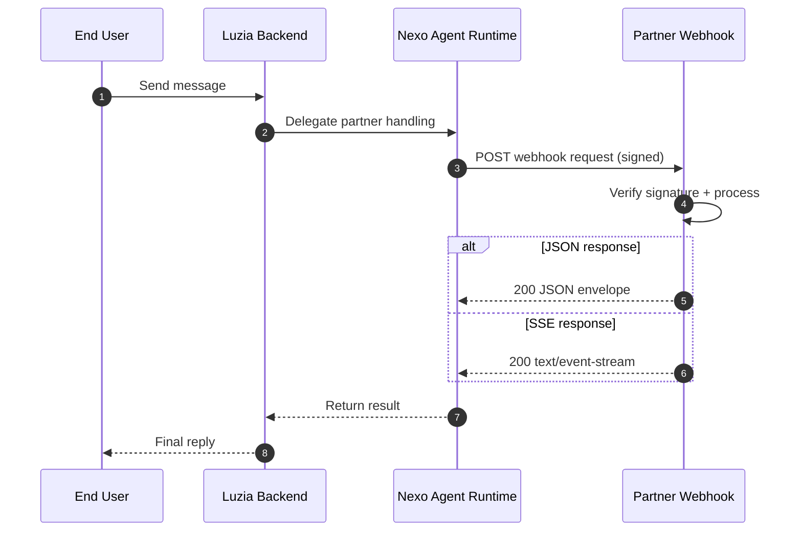

# Luzia Nexo API

Build apps for Luzia users.

This repository documents two developer lanes:

- **Partner Integrations** - external webhook-backed apps that run on your infrastructure.
- **Personalized Apps** - headless, user-scoped app creation and management through the Nexo API, MCP, and developer tooling.

The Nexo runtime handles routing, consent-managed profile context, rich UI payloads, and proactive delivery.

**[Documentation](https://the-wordlab.github.io/luzia-nexo-api/)** | **[Dashboard](https://nexo.luzia.com)**

## Quick start

**Partner Integrations**

1. Implement a `POST /webhook` endpoint
2. Return a valid JSON or SSE response envelope
3. Configure `webhook_url` and `WEBHOOK_SECRET` in Nexo
4. Send a test message from the dashboard

```json
{
  "schema_version": "2026-03",
  "status": "completed",
  "content_parts": [{ "type": "text", "text": "Your assistant response" }]
}
```

See the [Quickstart guide](https://the-wordlab.github.io/luzia-nexo-api/quickstart/) for the webhook lane.

**Personalized Apps**

Create structured apps from the terminal via MCP:

```bash
# Get your developer key from the dashboard (Profile → Developer Access)
export NEXO_DEVELOPER_KEY=nexo_uak_...
export NEXO_BASE_URL=http://localhost:8000

# Connect MCP
claude mcp add --scope project --transport http nexo-mcp \
  "${NEXO_BASE_URL}/mcp" \
  -H "X-Api-Key: ${NEXO_DEVELOPER_KEY}"

# Open Claude Code and ask:
# "Create an expense tracker for shared household bills"
```

Set `NEXO_BASE_URL` to the MCP base URL for your environment. Local
(`http://localhost:8000`) is the verified default for the DX flow in this repo.
For hosted MCP, use the backend base URL for the environment, not the dashboard
host:

- staging MCP: `https://nexo-cdn-alb.staging.thewordlab.net`
- production MCP: `https://luzia-nexo.thewordlab.net`

Dashboard sign-in and key provisioning still happen on `https://staging.nexo.luzia.com`
and `https://nexo.luzia.com`.

See the [Personalized Apps API](https://the-wordlab.github.io/luzia-nexo-api/micro-apps-api/)
and [MCP Server](https://the-wordlab.github.io/luzia-nexo-api/mcp/) guides.

## Integration architecture



This webhook flow is the **primary external integration path**. Personalized Apps use the same Nexo runtime, but are managed through Nexo-owned APIs and tools instead of partner webhooks.

## What's in this repository

| Path | Description |
|---|---|
| [`examples/webhook/`](examples/webhook/) | Partner Integration examples (Python + TypeScript) |
| [`examples/hosted/`](examples/hosted/) | Reference API services for Cloud Run |
| [`sdk/javascript/`](sdk/javascript/) | TypeScript SDK for webhook verification and proactive messaging |
| [`scripts/`](scripts/) | Deployment and seeding utilities |
| [`docs/`](docs/) | Documentation source ([published site](https://the-wordlab.github.io/luzia-nexo-api/)) |

## Profile context

Webhook payloads may include approved profile attributes such as `locale`, `language`, `location`, `age`, `gender`, `dietary_preferences`, and more. Nexo manages consent and scope enforcement before proxying profile data to your webhook. Parse defensively and ignore unknown fields.

## Secret boundaries

- `WEBHOOK_SECRET` -- used for Nexo webhook signature verification and as the app-level secret (`X-App-Secret`) for Partner API calls.
- `EXAMPLES_SHARED_API_SECRET` -- optional hardening for hosted reference services only.

For production integrations, use app credentials (`X-App-Id` + `X-App-Secret`) and webhook signing with `WEBHOOK_SECRET`.

## Development

```bash
make setup-dev        # Set up local toolchain
make test-all         # Run all tests
make docs-build       # Build documentation site
```

## Support

- [nexo.luzia.com](https://nexo.luzia.com)
