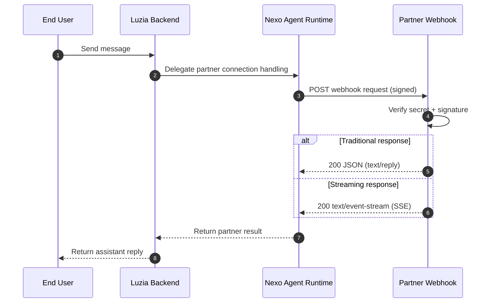

# Luzia Nexo API

Reference implementation for Nexo partner integrations.

Use this repository to:
- build and test webhook handlers (Python or TypeScript)
- send proactive Partner API requests
- reference optional deployment examples (Docker, Cloud Run)

## Links

- API Documentation: [the-wordlab.github.io/luzia-nexo-api](https://the-wordlab.github.io/luzia-nexo-api/)
- Luzia Nexo: [nexo.luzia.com/partners](https://nexo.luzia.com/partners)

## Webhook flow (target architecture)



## Quick start

1. Implement your webhook endpoint in your backend.
2. Configure your webhook URL and app secret at [nexo.luzia.com/partners](https://nexo.luzia.com/partners).
3. Test your webhook response shape locally:

```json
{
  "text": "Your assistant response"
}
```

4. Verify request signature handling (`X-Timestamp`, `X-Signature`) using the contract in [API Reference](docs/partner-api-reference.md).

Continue with full docs: [Quickstart](docs/quickstart.md), [API Reference](docs/partner-api-reference.md), [Hosting (Optional)](docs/hosting.md)

## Repository map

- `examples/` - local webhook and partner API examples
- `examples-hosted/` - Cloud Run deployable example services
- `infra/terraform/` - GCP infrastructure
- `docs/` - integration documentation

## Maintainer commands

```bash
make check-toolchain
make test-all
make docs-build
```

## Support

- [mmm@luzia.com](mailto:mmm@luzia.com)
