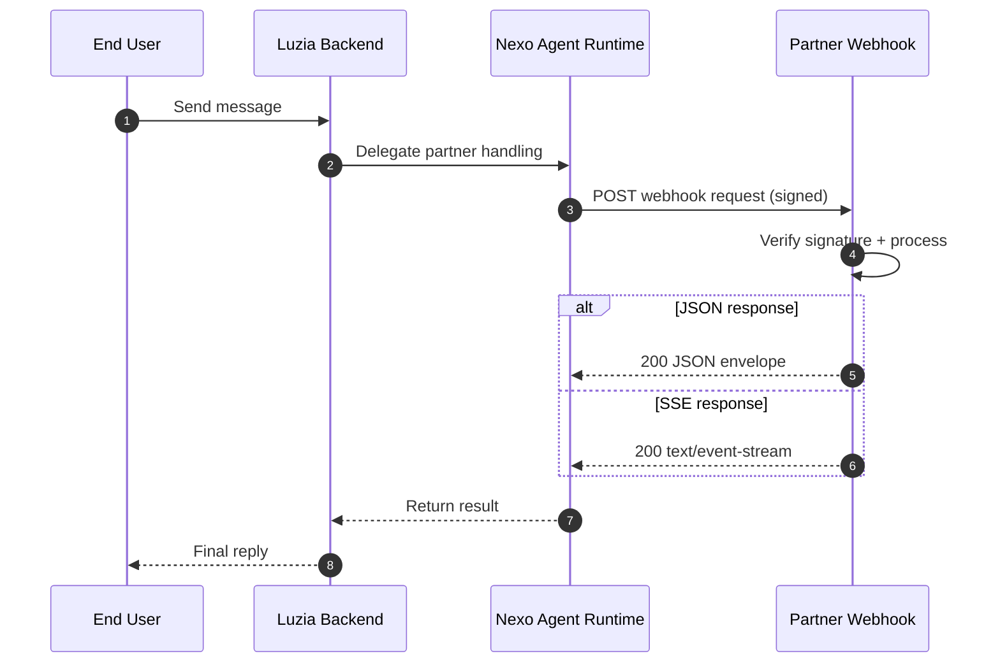

# Luzia Nexo API

Build apps on top of Nexo, Luzia's apps runtime.

This repository documents the two external developer lanes:

- **Connected Apps** - external webhook-backed apps that run on your infrastructure.
- **Personalized Apps** - structured apps you create and manage through Nexo APIs, MCP, and developer tooling.

Nexo handles routing, consent-managed profile context, rich UI payloads, streaming, and proactive delivery. This repo is the external examples and documentation companion to the main `luzia-nexo` runtime.

**[Documentation](https://the-wordlab.github.io/luzia-nexo-api/)** | **[Dashboard](https://nexo.luzia.com)**

## Quick start

**Connected Apps**

1. Implement a `POST /webhook` endpoint
2. Return a valid JSON or SSE response envelope
3. Configure `webhook_url` and `WEBHOOK_SECRET` in Nexo
4. Send a test message from the dashboard

```json
{
  "schema_version": "2026-03",
  "status": "completed",
  "content_parts": [{ "type": "text", "text": "Your assistant response" }]
}
```

See the [Quickstart guide](https://the-wordlab.github.io/luzia-nexo-api/quickstart/) for the Connected Apps webhook lane.

**Personalized Apps**

Create structured apps from the terminal via MCP:

```bash
# Get your developer key from the dashboard (Profile → Developer Access)
export NEXO_DEVELOPER_KEY=nexo_uak_...
export NEXO_BASE_URL=http://localhost:8000

# Connect MCP
claude mcp add --scope project --transport http nexo-mcp \
  "${NEXO_BASE_URL}/mcp" \
  -H "X-Api-Key: ${NEXO_DEVELOPER_KEY}"

# Open Claude Code and ask:
# "Create an expense tracker for shared household bills"
```

Recommended creation grammar:

1. clarify the goal in natural language
2. `plan_app`
3. review the proposed shape
4. `provision_app`
5. inspect with `show_app` or `get_context`
6. evolve with `plan_operation` / `apply_operation`

This is the same underlying creation model used by the dashboard Builder chat
experience. The UI and MCP are two surfaces over the same creation contract,
not separate products.

You do not need to understand Nexo runtime internals to use this lane. Treat
Nexo as a product backend you interact with through the dashboard, REST API,
and MCP tools.

The sharper builder read is:

- Nexo can add a new Luzia-facing capability without the builder learning Nexo
  internals
- that capability can have durable state, context, and runtime UI
- MCP, REST, and runtime entrypoints are the only seams the builder needs

If you already know the exact backend shape you want, there is now a faster
schema-first REST path as well:

- `POST /api/micro-apps/provision` creates the app, tables, fields, and an
  optional Knowledge Pack in one call
- use it for setup scripts, seeded reference apps, and exact-shape bootstraps
- use MCP prompt planning when the shape should be discovered through language,
  not specified up front

Use the advanced manual path (`create_app`) only when you already know the
exact schema you want and intentionally want to start from an empty shell.

Use follow-through features only when the app needs them:
- **Knowledge Packs** for app-attached reference data or deterministic
  projections
- **Raw Data** for direct record-level inspection or editing after the app
  exists
- **Connect Website** when the app should be associated with an owned domain
- **public share** when you need temporary or revocable public access

Set `NEXO_BASE_URL` to the MCP base URL for your environment. Local
(`http://localhost:8000`) is the verified default for the DX flow in this repo.
For hosted MCP, use the backend base URL for the environment, not the dashboard
host:

- staging MCP: `https://nexo-cdn-alb.staging.thewordlab.net`
- production MCP: `https://luzia-nexo.thewordlab.net`

Dashboard sign-in and key provisioning still happen on `https://staging.nexo.luzia.com`
and `https://nexo.luzia.com`.

See the [Personalized Apps API](https://the-wordlab.github.io/luzia-nexo-api/micro-apps-api/)
and [MCP Server](https://the-wordlab.github.io/luzia-nexo-api/mcp/) guides.

## Integration architecture



This webhook flow is the **primary external Connected Apps path**. Personalized
Apps use the same Nexo runtime, but are managed through Nexo-owned APIs and
tools instead of partner webhooks.

Taken together, the two lanes mean Nexo is not only an integration surface. It
is also the backend/runtime layer where Luzia can gain new dynamic capabilities
with durable state and UI.

## What's in this repository

| Path | Description |
|---|---|
| [`examples/webhook/`](examples/webhook/) | Connected App examples (Python + TypeScript) |
| [`examples/hosted/`](examples/hosted/) | Reference API services for Cloud Run |
| [`sdk/javascript/`](sdk/javascript/) | TypeScript SDK for webhook verification and proactive messaging |
| [`scripts/`](scripts/) | Deployment and seeding utilities |
| [`docs/`](docs/) | Documentation source ([published site](https://the-wordlab.github.io/luzia-nexo-api/)) |

## Profile context

Webhook payloads may include approved profile attributes such as `locale`, `language`, `location`, `age`, `gender`, `dietary_preferences`, and more. Nexo manages consent and scope enforcement before proxying profile data to your webhook. Parse defensively and ignore unknown fields.

## Secret boundaries

- `WEBHOOK_SECRET` -- used for Nexo webhook signature verification and as the app-level secret (`X-App-Secret`) for Partner API calls.
- `EXAMPLES_SHARED_API_SECRET` -- optional hardening for hosted reference services only.

For production integrations, use app credentials (`X-App-Id` + `X-App-Secret`) and webhook signing with `WEBHOOK_SECRET`.

## Development

```bash
make setup-dev        # Set up local toolchain
make test-all         # Run all tests
make docs-build       # Build documentation site
```

### Local full-stack development (optional sibling Nexo runtime)

Most MCP workflows, demo scripts, and integration tests need a running Nexo
backend. If you have the `luzia-nexo` runtime repo checked out as a sibling:

You still build against Nexo only through the published dashboard/API/MCP
surfaces. You do not need knowledge of the runtime's internal modules.

```bash
# 1. Start the Nexo runtime (in ../luzia-nexo)
cd ../luzia-nexo
make setup                # first time only: DB + migrations + seeds
make seed-demo            # seed demo apps and characters
make start-backend        # backend on http://localhost:8000
make start-frontend       # frontend on http://localhost:3000 (needed for dashboard)

# 2. Get a developer key
#    Open http://localhost:3000 -> login (admin@luzia.com / password from .env)
#    -> Profile -> Developer Access -> Create key

# 3. Set credentials (in this repo)
export NEXO_DEVELOPER_KEY=nexo_uak_...
export NEXO_BASE_URL=http://localhost:8000

# 4. Connect MCP and start building
claude mcp add --scope project --transport http nexo-mcp \
  "${NEXO_BASE_URL}/mcp" \
  -H "X-Api-Key: ${NEXO_DEVELOPER_KEY}"

# 5. Create your app
#    Ask Claude/Codex for the app in natural language:
#    "Create a world cup predictions app with teams, fixtures, and leaderboard views"

# 6. Run demo/integration scripts against local Nexo
./scripts/test-live-demos.sh                    # conversational demo pass
./scripts/integration-smoke.sh --webhook-url https://your-webhook.run.app
```

See [MCP Server docs](https://the-wordlab.github.io/luzia-nexo-api/mcp/) for
the full connection guide, curl examples, and multi-client setup.

## Support

- [nexo.luzia.com](https://nexo.luzia.com)
