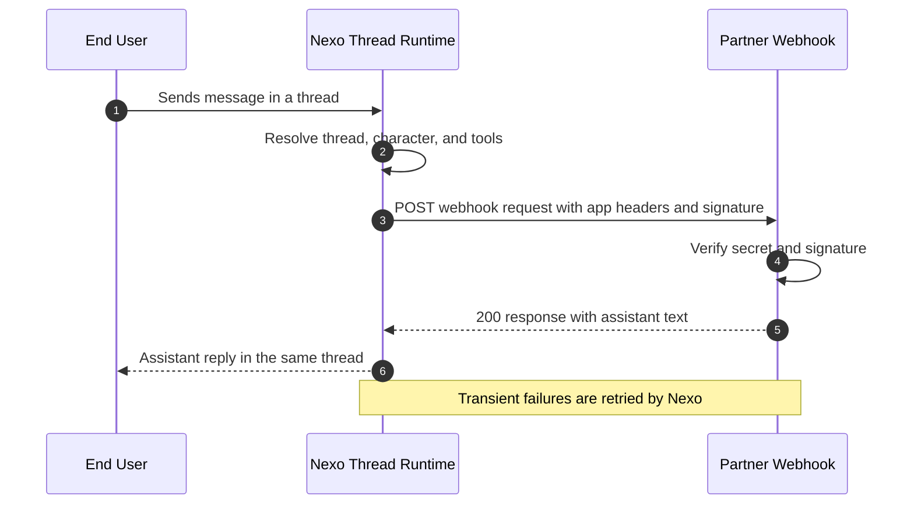

# Luzia Nexo API

Partner integration repository for runnable examples, demo webhook receiver, and SDK assets.

This repository is intentionally separate from `luzia-nexo` runtime infrastructure.

GitHub: [github.com/The-Wordlab/luzia-nexo-api](https://github.com/The-Wordlab/luzia-nexo-api)
Docs site (partner-facing): [the-wordlab.github.io/luzia-nexo-api](https://the-wordlab.github.io/luzia-nexo-api/)
Quick onboarding: [docs/onboarding.md](docs/onboarding.md)
Quickstart: [docs/quickstart.md](docs/quickstart.md)

Nexo links:
- Partner portal (API secret provisioning): [nexo.luzia.com/partners](https://nexo.luzia.com/partners)
- Nexo dashboard: [nexo.luzia.com](https://nexo.luzia.com)
- Support contact: [mmm@luzia.com](mailto:mmm@luzia.com) (Mark MacMahon)

## Integration at a glance



## Scope

In scope:
- Partner-facing webhook and proactive API examples
- Demo receiver service for stable webhook URLs
- SDK packaging and partner integration helpers
- Cloud Run deployment assets for demo receiver
- Public, partner-friendly documentation and examples

Out of scope:
- Production ECS or AWS infrastructure from `luzia-nexo`
- Dashboard runtime feature implementation
- Platform-specific dev environment artifacts

## Deploy naming convention

Deployed resources use explicit service names:

- Demo receiver service: `nexo-demo-receiver`
- Hosted Python examples service: `nexo-examples-py`
- Hosted TypeScript examples service: `nexo-examples-ts`
- Runtime service account: `nexo-examples-runtime`

## Canonical contract source

The canonical API contract remains in `luzia-nexo` OpenAPI and system docs.
This repo consumes that contract and provides partner-facing implementations.

## Repository map

- `examples/` - webhook and proactive API examples
- `examples-hosted/` - deployable Cloud Run services for Python and TypeScript examples
- `demo-receiver/` - hosted demo receiver service
- `sdk/` - partner SDK packages
- `infra/terraform/` - GCP infrastructure definitions
- `docs/` - partner-facing documentation for integration and deployment

## Development

### Runtime versions (pinned)

- Node.js: `22` (see `.nvmrc`)
- Python: `3.12` (see `.python-version`)

```bash
make check-toolchain
```

### Run tests

```bash
make test-all
```

### Build docs portal

```bash
make docs-build
make docs-serve
```

### Bootstrap Google Cloud access

```bash
gcloud auth login --update-adc
gcloud auth application-default login
make gcp-bootstrap
```

`make gcp-bootstrap` sets the default `gcloud` project and ADC quota project for the values you pass (or your local defaults).

### Deploy without inline env vars

```bash
cp demo-receiver/deploy/cloudrun/env.example demo-receiver/deploy/cloudrun/env.local
# set PROJECT_ID in env.local once
make deploy-demo-receiver
```

### Deploy hosted examples (Python + TypeScript)

```bash
cp examples-hosted/python/deploy/cloudrun/env.example examples-hosted/python/deploy/cloudrun/env.local
cp examples-hosted/typescript/deploy/cloudrun/env.example examples-hosted/typescript/deploy/cloudrun/env.local
# set EXAMPLES_SHARED_API_SECRET in both env.local files
make deploy-examples
make verify-examples EXAMPLES_SHARED_API_SECRET=your-shared-secret
```

### Live hosted service URLs

- Demo receiver: [nexo-demo-receiver](https://nexo-demo-receiver-v3me5awkta-ew.a.run.app)
- Hosted Python examples: [nexo-examples-py](https://nexo-examples-py-v3me5awkta-ew.a.run.app)
- Hosted TypeScript examples: [nexo-examples-ts](https://nexo-examples-ts-v3me5awkta-ew.a.run.app)

### Run individual suites

```bash
make test-demo-receiver
make test-examples
make test-hosted-examples
make test-sdk
```
