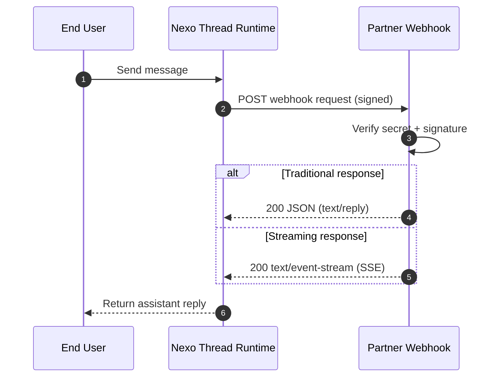

# Luzia Nexo API

Reference implementation for Nexo partner integrations.

Use this repository to:
- build and test webhook handlers (Python or TypeScript)
- send proactive Partner API requests
- deploy hosted examples on Cloud Run

## Links

- Partner docs: [the-wordlab.github.io/luzia-nexo-api](https://the-wordlab.github.io/luzia-nexo-api/)
- Partner portal: [nexo.luzia.com/partners](https://nexo.luzia.com/partners)
- Support: [mmm@luzia.com](mailto:mmm@luzia.com)

## Webhook flow



## Quick start

1. Get your app secret at [nexo.luzia.com/partners](https://nexo.luzia.com/partners).
2. Test a hosted example endpoint:

```bash
curl -X POST "https://nexo-examples-py-v3me5awkta-ew.a.run.app/webhook/minimal" \
  -H "Content-Type: application/json" \
  -H "X-App-Secret: <your-shared-secret>" \
  -d '{"message":{"content":"hello"}}'
```

3. Continue with full docs: [Quickstart](docs/quickstart.md), [Examples](docs/examples.md), [Partner API Reference](docs/partner-api-reference.md)

## Repository map

- `examples/` - local webhook and partner API examples
- `examples-hosted/` - Cloud Run deployable example services
- `demo-receiver/` - demo webhook receiver service
- `infra/terraform/` - GCP infrastructure
- `docs/` - partner documentation

## Developer commands

```bash
make check-toolchain
make test-all
make docs-build
```
