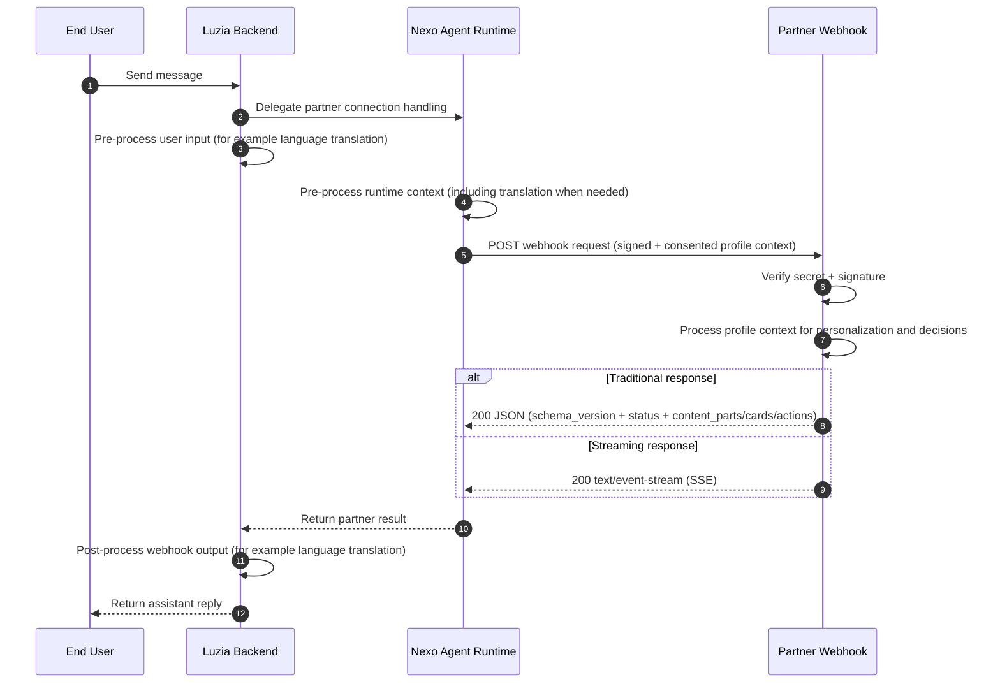

# Luzia Nexo API

Reference implementation for Nexo partner integrations.

Nexo provides a managed Agent Runtime with consented user-profile context and reliable webhook delivery, so you can connect your APIs and agentic flows to Luzia with clarity and control.

It's really that simple.

Use this repository to:
- build and test webhook handlers (Python or TypeScript)
- send proactive Partner API requests
- reference optional deployment examples (Docker, Cloud Run)

## Links

- API Documentation: [the-wordlab.github.io/luzia-nexo-api](https://the-wordlab.github.io/luzia-nexo-api/)
- Luzia Nexo: [nexo.luzia.com/partners](https://nexo.luzia.com/partners)

## Webhook flow (integration architecture)



## Quick start

1. Get your app secret at [nexo.luzia.com/partners](https://nexo.luzia.com/partners).
2. Implement your webhook endpoint.
3. Activate your webhook in Nexo by configuring your webhook URL and app secret.

Note: app secret setup is required for live Nexo delivery. You can still run and test webhook examples locally from this repository without provisioning a partner app.

```json
{
  "schema_version": "2026-03-01",
  "status": "success",
  "content_parts": [{ "type": "text", "text": "Your assistant response" }]
}
```

See [API Reference](docs/partner-api-reference.md) for payload, signature, and response contract details.

Read the full integration guide: [API Documentation](https://the-wordlab.github.io/luzia-nexo-api/)

## Profile context (current and next)

- Webhook payloads include consented profile attributes such as:
  - `locale`
  - `language`
  - `location` (for example city/country)
  - `age` or age range
  - `date_of_birth`
  - `gender`
  - `dietary_preferences`
  - `preferences` and selected profile facts
- Availability depends on app permissions and user consent.
- Additional attributes are added over time while keeping backward compatibility.
- Recommended: parse profile fields defensively and ignore unknown fields.

## Repository map

- [`examples/`](examples/) - local webhook and partner API examples
- [`examples/hosted/`](examples/hosted/) - Cloud Run deployable example services (including demo receiver)
- [`infra/terraform/`](infra/terraform/) - GCP infrastructure
- [`docs/`](docs/) - documentation source for the published docs site

## Local toolchain setup

Use a project virtualenv for Python commands:

```bash
python3 -m venv .venv
source .venv/bin/activate
python -m pip install -U pip pytest
```

## Maintainer commands

```bash
source .venv/bin/activate
make check-toolchain
make test-all
make docs-build
```

## Support

- [mmm@luzia.com](mailto:mmm@luzia.com)
