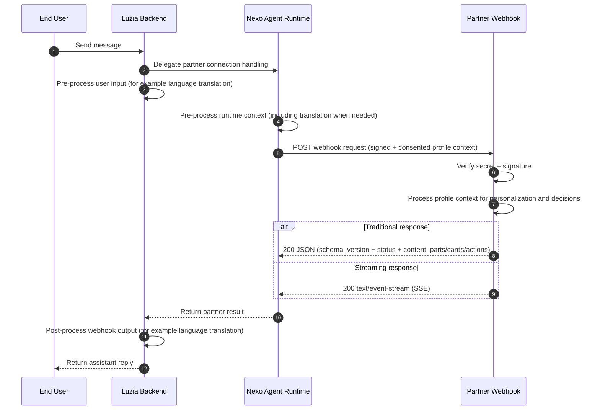

# Luzia Nexo API

Reference implementation for Nexo partner integrations.

Nexo provides a managed Agent Runtime with consented user-profile context and reliable webhook delivery, so you can connect your APIs and agentic flows to Luzia with clarity and control.

It's really that simple.

Use this repository to:
- build and test webhook handlers (Python or TypeScript)
- send proactive Partner API requests
- reference optional deployment examples (Docker, Cloud Run)

Model/runtime policy for partner RAG examples:
- Production on Cloud Run: Gemini on Vertex via ADC (no Gemini API key)
- Development override: OpenAI by setting `OPENAI_API_KEY`, `LLM_MODEL`, and `EMBEDDING_MODEL`
- Durable vectors in Cloud Run: pgvector on Cloud SQL
- Automated indexing: Cloud Scheduler endpoint jobs or Cloud Run worker jobs

## Links

- API Documentation: [the-wordlab.github.io/luzia-nexo-api](https://the-wordlab.github.io/luzia-nexo-api/)
- Luzia Nexo: [nexo.luzia.com/partners](https://nexo.luzia.com/partners)

## Webhook flow (integration architecture)



## Quick start

1. Get your app secret at [nexo.luzia.com/partners](https://nexo.luzia.com/partners).
2. Implement your webhook endpoint.
3. Activate your webhook in Nexo by configuring your webhook URL and app secret.

Note: app secret setup is required for live Nexo delivery. You can still run and test webhook examples locally from this repository without provisioning a partner app.

```json
{
  "schema_version": "2026-03-01",
  "status": "success",
  "content_parts": [{ "type": "text", "text": "Your assistant response" }]
}
```

See [API Reference](docs/partner-api-reference.md) for payload, signature, and response contract details.

Read the full integration guide: [API Documentation](https://the-wordlab.github.io/luzia-nexo-api/)

## Profile context (current and next)

- Webhook payloads include consented profile attributes such as:
  - `locale`
  - `language`
  - `location` (for example city/country)
  - `age` or age range
  - `date_of_birth`
  - `gender`
  - `dietary_preferences`
  - `preferences` and selected profile facts
- Availability depends on app permissions and user consent.
- Additional attributes are added over time while keeping backward compatibility.
- Recommended: parse profile fields defensively and ignore unknown fields.

## Demo app seeding

This repository is the single source of truth for demo app definitions. The seed script creates demo apps in a Nexo instance via the HTTP API.

```bash
# Preview what would happen
python3 scripts/seed-demo-apps.py --dry-run

# Seed against local Nexo (http://localhost:8000)
python3 scripts/seed-demo-apps.py --env local

# Seed against production
NEXO_API_URL=https://nexo.example.com \
NEXO_ADMIN_EMAIL=admin@example.com \
NEXO_ADMIN_PASSWORD=secret \
python3 scripts/seed-demo-apps.py --env production

# CI-safe mode (skip webhook apps that need external services)
python3 scripts/seed-demo-apps.py --ci-safe
```

Demo app definitions are in `scripts/demo-apps.json`. Environment profiles are in `scripts/seed-config.json`. Environment variables always override config file values.

## Repository map

- [`scripts/demo-apps.json`](scripts/demo-apps.json) - demo app definitions (14 apps, org, character, card trigger rules)
- [`scripts/seed-demo-apps.py`](scripts/seed-demo-apps.py) - HTTP-based demo seeder
- [`scripts/seed-config.json`](scripts/seed-config.json) - environment profiles (local, production)
- [`examples/`](examples/) - local webhook and partner API examples
- [`examples/hosted/`](examples/hosted/) - Cloud Run deployable example services (including demo receiver)
- [`sdk/javascript/`](sdk/javascript/) - TypeScript SDK (`@nexo/partner-sdk`) for webhook verification and proactive messaging
- [`tests/README.md`](tests/README.md) - test layout and recommended confidence gates
- [`docs/`](docs/) - documentation source for the published docs site

## Local toolchain setup

Set up the local toolchain once:

```bash
make setup-dev
```

## Maintainer commands

```bash
make check-toolchain
make test-all
make docs-build
make deploy-all-examples   # deploy all server-side examples to Cloud Run
make setup-rag-production  # deploy RAG + scheduler endpoint indexing
# or:
# SCHEDULER_RUNNER_SA=<sa-email> make setup-rag-production-workers
```

## Support

- [nexo.luzia.com/partners](https://nexo.luzia.com/partners)
