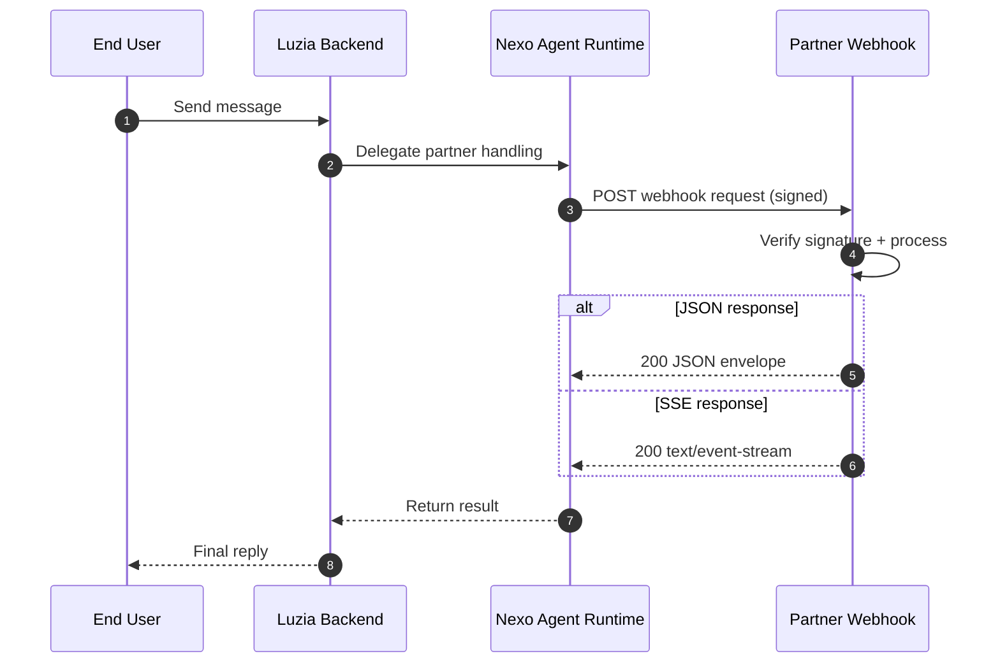

# Luzia Nexo Agent Runtime API

Build conversational partner integrations for Luzia users. The Nexo Agent Runtime provides signed webhook delivery, consented profile context, rich UI payloads, and proactive push events.

**[Documentation](https://the-wordlab.github.io/luzia-nexo-api/)** | **[Dashboard](https://nexo.luzia.com)**

## Quick start

1. Implement a `POST /webhook` endpoint
2. Return a valid JSON or SSE response envelope
3. Configure `webhook_url` and `WEBHOOK_SECRET` in Nexo
4. Send a test message from the dashboard

```json
{
  "schema_version": "2026-03",
  "status": "completed",
  "content_parts": [{ "type": "text", "text": "Your assistant response" }]
}
```

See the [Quickstart guide](https://the-wordlab.github.io/luzia-nexo-api/quickstart/) for full details.

## Integration architecture



## What's in this repository

| Path | Description |
|---|---|
| [`examples/webhook/`](examples/webhook/) | Webhook integration examples (Python + TypeScript) |
| [`examples/hosted/`](examples/hosted/) | Reference API services for Cloud Run |
| [`sdk/javascript/`](sdk/javascript/) | TypeScript SDK for webhook verification and proactive messaging |
| [`scripts/`](scripts/) | Deployment and seeding utilities |
| [`docs/`](docs/) | Documentation source ([published site](https://the-wordlab.github.io/luzia-nexo-api/)) |

## Profile context

Webhook payloads include consented profile attributes such as `locale`, `language`, `location`, `age`, `gender`, `dietary_preferences`, and more. Availability depends on app permissions and user consent. Parse defensively and ignore unknown fields.

## Secret boundaries

- `WEBHOOK_SECRET` -- used for Nexo webhook signature verification and as the app-level secret (`X-App-Secret`) for Partner API calls.
- `EXAMPLES_SHARED_API_SECRET` -- optional hardening for hosted reference services only.

For production integrations, use app credentials (`X-App-Id` + `X-App-Secret`) and webhook signing with `WEBHOOK_SECRET`.

## Development

```bash
make setup-dev        # Set up local toolchain
make test-all         # Run all tests
make docs-build       # Build documentation site
```

## Support

- [nexo.luzia.com](https://nexo.luzia.com)
