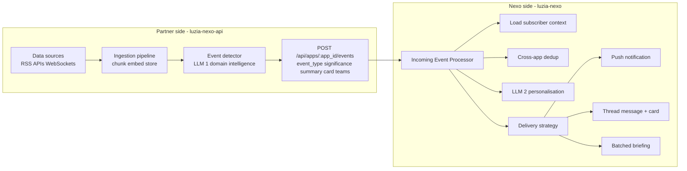
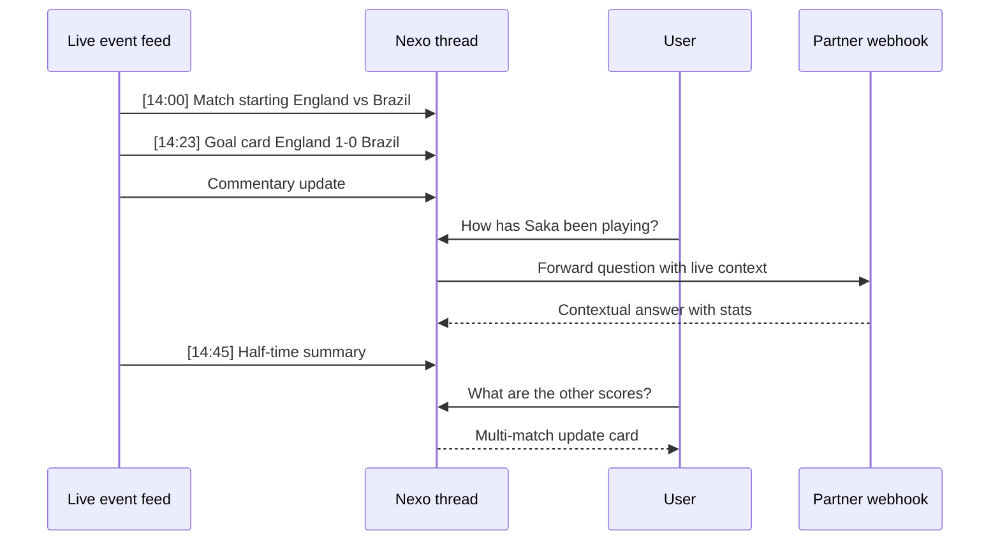
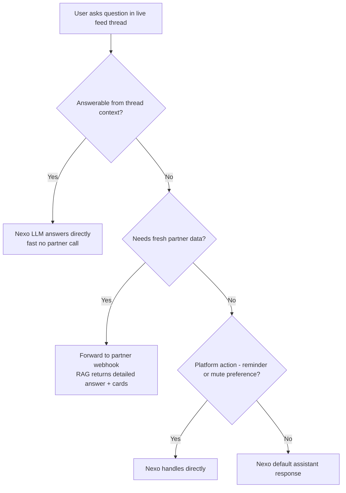

# Design: Live Streaming Intelligence

## Problem

Today's RAG examples are **pull-based**: a user asks a question, we search ChromaDB, call an LLM, and return a response. The data is there (RSS feeds refresh every 15 min, football-data.org has live scores) but nothing happens until someone asks.

This means:
- A goal is scored and nobody finds out until they open the app and ask
- Breaking news sits in the index for minutes before anyone sees it
- The World Cup final is happening and the partner app is silent

## Vision

**Two-layer push intelligence.** The system has two distinct LLM processing stages:

**Partner LLM (domain intelligence):** "Is this data worth sending?"
1. **Continuously ingests** data sources (RSS, APIs, websockets)
2. **Detects events** worth sending (goals, red cards, breaking transfers, match start/end)
3. **Classifies significance** and generates a raw event summary
4. **Pushes events** to Nexo via Partner API

**Nexo LLM (delivery intelligence):** "How should this specific user experience this event?"
1. **Per-subscriber personalisation** - each user has a different relationship to the event (Arsenal fan vs Chelsea fan vs neutral)
2. **Character voice** - the notification speaks through the user's AI companion, aware of conversation history and preferences
3. **Cross-app aggregation** - deduplicates events from multiple partner apps, merges into coherent briefings
4. **Delivery orchestration** - quiet hours, rate limiting, channel selection (push vs in-app card vs batched summary)
5. **Locale mediation** - translates notifications for users in different languages (reuses existing pipeline)

The partner owns domain detection. Nexo owns the user experience.

## Architecture



### Two-LLM pipeline explained

**LLM #1 (Partner - domain expert):**
- Runs on the partner's infrastructure, uses partner's API keys
- Domain-specific: understands football rules, news significance, financial thresholds
- Output: structured event with type, significance score, raw summary, card data
- Cost borne by partner

**LLM #2 (Nexo - user experience expert):**
- Runs on Nexo's infrastructure
- User-specific: knows the subscriber's character, conversation history, locale, preferences
- Decides: "Sarah is an Arsenal fan who speaks French and asked about Saliba yesterday. This Arsenal goal should mention Saliba's assist and be delivered in French through her enthusiastic commentator character."
- Also decides: "Carlos already got 4 notifications this hour. Batch this into a half-time summary instead."
- Reuses existing infrastructure: character prompts, locale mediation pipeline, MessageProcessor protocol
- Cost borne by Nexo (platform cost, passed through to partner via usage tiers)

## The User Experience: Live Feed + Conversation

The Nexo chat thread becomes a **living feed**, not a static Q&A. The user sees events streaming in - goals, news, updates - as messages from their AI character. But critically, they can **talk back**.



### How this works

1. **Events stream in** as thread messages from the partner (via Nexo's incoming processor). The character wraps each event in personality and context.

2. **User asks a question** in the same thread. This triggers the normal webhook flow - the message goes to the partner's RAG endpoint, which has all the live data indexed.

3. **The character has full context** because events and questions live in the same thread. The LLM sees the conversation history: "the user just saw the Bellingham goal and is now asking about Saka" - it can give a contextual answer, not a cold RAG lookup.

4. **Nexo's incoming processor decides** how to present each event:
   - **High significance** (goal): immediate message + card + push notification
   - **Medium significance** (yellow card): inline message in thread, no push
   - **Low significance** (corner kick): suppressed unless user has "all events" mode
   - **Batched** (half-time): aggregate 5-10 events into a summary

5. **Questions can be answered locally or forwarded**:
   - "How has Saka been playing?" - forwarded to partner webhook (needs match stats from RAG)
   - "What time does the next match start?" - Nexo's processor can answer from event metadata without calling the partner
   - "Remind me when the second half starts" - Nexo schedules a notification (no partner involvement)

### The Thread as Personalised World View

Each subscriber has a thread per app. That thread is their **personalised feed** - it contains only the events Nexo decided were relevant to them, framed through their character, in their language.

This means when a user asks a question, the LLM already has the answer context **in the thread history**:

- **Thread for Sarah (Arsenal fan, en-US):** 5 Arsenal-related events, 2 general PL updates, her 3 previous questions
- **Thread for Carlos (neutral, pt-BR):** all goals from all matches, in Portuguese, through a Brazilian commentator character
- **Thread for Marie (casual fan, fr):** only high-significance events, in French, batched into half-time summaries

When Sarah asks "How are Arsenal doing today?", the LLM doesn't need to search the entire RAG index - it can see the last 5 events in her thread and synthesise. If she asks something deeper ("What's Saka's pass completion rate?"), it gets forwarded to the partner webhook which has the detailed stats.

**The decision tree for answering questions:**



This is powerful because the thread context means Nexo can answer most casual questions **without calling the partner at all**. The partner webhook is only invoked for questions that need fresh data or domain-specific intelligence.

### The Nexo Incoming Event Processor

This is a new `MessageProcessor` (same protocol as LocaleMediator) that sits in the Nexo orchestrator pipeline:

```python
class IncomingEventProcessor:
    """Processes events pushed by partners into subscriber-specific experiences."""

    async def process_event(
        self,
        event: PartnerEvent,
        subscriber: Subscriber,
        app: App,
        character: Character | None,
    ) -> list[DeliveryAction]:
        """
        Given a raw partner event + subscriber context, decide:
        1. Should this subscriber see this event at all?
        2. How should it be framed (character voice, locale, context)?
        3. What delivery channel(s) should be used?
        4. Should it be batched with other recent events?
        """

        # 1. Subscriber relevance check
        if not self._is_relevant(event, subscriber):
            return []

        # 2. Rate limit / quiet hours check
        delivery_budget = self._check_delivery_budget(subscriber)
        if delivery_budget.exhausted and event.significance < 0.8:
            return [DeliveryAction.BATCH]  # hold for next digest

        # 3. Cross-app dedup
        if self._is_duplicate(event, subscriber):
            return []

        # 4. LLM personalisation: character voice + subscriber context
        personalised = await self._personalise(
            event=event,
            subscriber=subscriber,
            character=character,
            thread_history=await self._recent_thread_messages(subscriber, app),
        )

        # 5. Locale mediation (reuse existing pipeline)
        if subscriber.locale != event.locale:
            personalised = await self._translate(personalised, subscriber.locale)

        # 6. Determine delivery channels based on significance + context
        actions = self._plan_delivery(
            personalised,
            event.significance,
            delivery_budget,
            subscriber_is_online=self._is_in_active_session(subscriber),
        )

        return actions
```

### Delivery strategies

| User state | High significance (0.8+) | Medium (0.5-0.8) | Low (0.3-0.5) |
|---|---|---|---|
| **In active chat session** | Inline message + card (no push - they're already looking) | Inline message | Suppress or subtle indicator |
| **App open, different page** | In-app notification badge + push | In-app badge only | Suppress |
| **App closed** | Push notification + thread message | Thread message only (see on next open) | Suppress |
| **Quiet hours** | Thread message only (no push) | Thread message only | Suppress |
| **Rate limit hit** | Push anyway (breaking) | Batch into digest | Suppress |

## Event Detection: The Intelligence Layer

This is the core innovation. Raw data is meaningless noise. The LLM turns it into signal.

### How it works

```python
class EventDetector:
    """Evaluates incoming data against significance criteria."""

    async def evaluate(self, item: IngestItem) -> Event | None:
        """Return an Event if this item is worth notifying about, else None."""

        # Fast path: keyword/rule-based pre-filter
        if not self._passes_prefilter(item):
            return None

        # Slow path: LLM classification
        classification = await self._classify(item)

        if classification.significance < self.threshold:
            return None

        return Event(
            type=classification.event_type,     # goal, red_card, match_start, breaking_news, transfer
            significance=classification.significance,  # 0.0 - 1.0
            summary=classification.summary,     # LLM-generated, 1-2 sentences
            detail=classification.detail,       # LLM-generated, full context
            card=classification.card,           # Nexo card envelope (optional)
            source_items=[item],
            timestamp=utcnow(),
        )
```

### Significance scoring

Not everything is worth a push notification. The LLM scores significance:

| Score | Meaning | Delivery | Example |
|---|---|---|---|
| 0.0 - 0.3 | Routine | Index only (RAG) | "Match scheduled for Saturday" |
| 0.3 - 0.6 | Notable | In-app card on next visit | "Saka returns to training" |
| 0.6 - 0.8 | Important | Thread message + card | "Arsenal 1-0 Chelsea (Saka 12')" |
| 0.8 - 1.0 | Breaking | Push notification + thread + card | "GOAL! Last-minute equaliser!" |

### Cost control

LLM calls on every ingest item would be expensive. The pipeline uses a **two-stage filter**:

1. **Rule-based pre-filter** (free, instant): keyword matching, score change detection, duplicate dedup
2. **LLM classification** (costs money, ~200ms): only items that pass pre-filter get LLM evaluation

For sports specifically:
- Score changes detected by diffing previous match state (no LLM needed)
- Red cards, penalties detected by keyword in goal/event descriptions
- LLM used for: summarising significance, generating natural language, deciding if a 0-0 draw is actually interesting

### Deduplication and cooldown

Same event shouldn't notify twice:
- Content hash dedup: same RSS article won't trigger again
- Match state tracking: goal already notified won't re-trigger on refresh
- Per-subscriber cooldown: max N notifications per hour per app (configurable)

## Subscriber Targeting

Not every subscriber wants every event. The partner decides who gets what.

### Subscription preferences (partner-managed)

```json
{
  "subscriber_id": "sub_abc123",
  "preferences": {
    "teams": ["Arsenal", "Liverpool"],
    "competitions": ["PL", "CL"],
    "event_types": ["goal", "match_start", "match_end", "breaking_news"],
    "min_significance": 0.6,
    "quiet_hours": { "start": "23:00", "end": "07:00", "timezone": "Europe/London" }
  }
}
```

The partner stores these preferences (in Firestore, Redis, or local DB). When an event is detected, the dispatcher queries: "which subscribers care about this?"

### Multicast flow

```
Event detected: "Arsenal 2-1 Chelsea (Rice 67')"
  → significance: 0.75 (Important)
  → teams: [Arsenal, Chelsea]
  → competition: PL

Subscriber query: who has Arsenal OR Chelsea in teams, AND PL in competitions, AND min_significance <= 0.75?
  → [sub_001 (Arsenal fan), sub_002 (Chelsea fan), sub_005 (PL follower)]

For each subscriber:
  → POST to Nexo Partner API with subscriber_id, event summary, card
  → Nexo resolves subscriber → user → push subscription
  → Character wraps message in personality
  → Delivered via push notification + thread message
```

## Nexo Integration Points

### 1. Partner API: POST /api/apps/{app_id}/notify (NEW)

The partner calls this endpoint to push a notification to subscribers.

```json
POST /api/apps/{app_id}/notify
Authorization: X-App-Id + X-App-Secret

{
  "subscriber_ids": ["sub_001", "sub_002"],    // or "all" for broadcast
  "message": {
    "text": "GOAL! Rice scores for Arsenal! Arsenal 2-1 Chelsea (67')",
    "summary": "Arsenal 2-1 Chelsea"           // short form for push notification title
  },
  "card": {
    "type": "match_result",
    "title": "Arsenal 2-1 Chelsea",
    "subtitle": "Premier League - Matchday 28",
    "badges": ["Premier League", "Live"],
    "fields": [
      { "label": "Goal", "value": "Rice 67'" },
      { "label": "Venue", "value": "Emirates Stadium" }
    ]
  },
  "priority": "high",                          // high = push notif, normal = thread only
  "character_voice": true                       // wrap in character personality
}
```

### 2. Character voice layer

When `character_voice: true`, Nexo wraps the notification through the app's character:

**Raw message:** "Arsenal 2-1 Chelsea. Rice scores in the 67th minute."

**Through character (e.g., enthusiastic sports commentator):**
"WHAT A STRIKE FROM RICE! Arsenal take the lead 2-1! Chelsea will be devastated - they were pushing hard for an equaliser!"

This uses the existing character `system_prompt` + a quick LLM call to rephrase. The character layer is optional - partners can send pre-formatted text if they prefer.

### 3. Existing infrastructure reused

| Nexo component | Role in live streaming |
|---|---|
| `PushSubscription` model | Stores VAPID endpoints for Web Push delivery |
| `push_service.send_push_notification()` | Delivers push notifications to user devices |
| `WebPushProvider` | RFC 8030 push protocol |
| `Subscriber` model | Maps partner subscriber_id to Nexo user |
| `Thread` + `Message` | Persistent conversation history (notifications appear in chat) |
| `Character.system_prompt` | Personality layer for notification voice |
| Outbox pattern | Async delivery for high-volume multicast |
| `content_json.cards` | Rich card rendering in chat UI |

### 4. Live SSE channel (partner-side, optional)

For real-time in-app updates (not push notifications), the partner can expose an SSE endpoint:

```
GET /live/events?competitions=PL,CL&teams=Arsenal
Accept: text/event-stream

data: {"type": "goal", "match": "Arsenal vs Chelsea", "score": "2-1", "scorer": "Rice", "minute": 67}
data: {"type": "card_update", "match_id": "match-001", "card": {...}}
data: {"type": "match_end", "match": "Arsenal vs Chelsea", "final_score": "2-1"}
```

Nexo's frontend could connect to this directly for live-updating cards, or the partner can push updates through the notify API.

## Use Cases

### World Cup 2026

The World Cup is the killer use case. 64 matches over 4 weeks, multiple time zones, massive global interest.

**Partner app: "World Cup Companion"**

- **Data sources**: football-data.org API (live scores), FIFA API, sports RSS feeds
- **Ingestion cadence**: every 60 seconds during live matches, every 15 min otherwise
- **Event types**:
  - `match_start` - "England vs Brazil kicks off in 5 minutes!"
  - `goal` - "GOAL! Bellingham scores for England! 1-0 vs Brazil (23')"
  - `red_card` - "RED CARD! Casemiro sent off for Brazil"
  - `half_time` - "Half-time: England 1-0 Brazil. Bellingham's header the difference"
  - `full_time` - "FULL TIME: England 2-1 Brazil! They're through to the semi-finals!"
  - `penalty_shootout` - Real-time updates for each penalty
  - `breaking_news` - "BREAKING: Mbappe ruled out of semi-final with hamstring injury"

**Subscriber preferences**:
- Follow specific teams (England, Brazil, Argentina...)
- Follow specific groups (Group A, knockout stage)
- "All goals" mode for the football purist
- Quiet hours for different time zones

**Character integration**:
- Default character: enthusiastic but factual commentator
- Optional: national team character ("As an England fan, I can barely contain myself...")
- The character knows the tournament context (group standings, elimination stakes)

### Live News Feed

Same pattern, different domain:

- **Data sources**: Reuters, AP, BBC RSS, custom news APIs
- **Event detection**: LLM classifies breaking vs routine news
- **Significance**: geopolitical events score higher, weather updates score lower
- **Subscriber targeting**: by topic (politics, tech, science), by region
- **Character**: news anchor personality, or domain-specific (tech journalist, financial analyst)

### Financial Markets

- **Data sources**: stock price APIs, earnings calendars, SEC filings
- **Event detection**: price movements beyond threshold, earnings surprises, analyst upgrades
- **Subscriber targeting**: by portfolio holdings, watchlist, sector
- **Character**: financial advisor personality with appropriate disclaimers

### Travel Companion (extending travel-rag)

- **Data sources**: flight status APIs, weather APIs, travel advisory RSS
- **Event detection**: flight delays, gate changes, severe weather at destination
- **Subscriber targeting**: by upcoming trip, by destination
- **Character**: travel concierge personality

## Implementation Plan

### Design principle: partner-first PoC

For the proof of concept, **all intelligence lives in the partner-agent API**. Nexo is a thin delivery layer - it receives events and forwards them to subscriber threads. This keeps the PoC simple and proves the core value (push-based intelligence) without building a complex Nexo-side processor.

The two-LLM architecture described above is the long-term vision. We get there incrementally:
- **PoC**: partner does everything (detection, personalisation, targeting). Nexo just delivers.
- **V1**: Nexo adds delivery orchestration (quiet hours, rate limiting, batching).
- **V2**: Nexo adds character voice, locale mediation, thread-context question answering.

This also means we can ship the PoC as a **reusable pattern** - any partner can build a live feed by implementing event detection in their webhook and calling the Nexo notify endpoint.

### Phase 1: Partner-side event detection + push (PoC scope)

Extend sports-rag with event detection, subscriber management, and Nexo delivery. The partner owns the full pipeline.

| Task | Size | Description |
|---|---|---|
| `MatchStateTracker` | M | Track previous match state, detect score changes, red cards, match start/end |
| `EventDetector` with LLM classification | M | Two-stage filter: rules + LLM. Significance scoring. |
| `EventStore` (Firestore or SQLite) | S | Persist detected events with dedup. Query by type, time, teams. |
| Background ingest upgrade | S | Increase cadence to 60s during live matches. Diff-based change detection. |
| Subscriber preferences (partner-side) | M | Firestore collection: teams, competitions, min_significance, quiet_hours per subscriber. |
| Subscriber targeting | M | When event detected, query matching subscribers, push to each. |
| Nexo delivery client | M | Partner calls Nexo notify endpoint for each subscriber. Handles auth, retry, backoff. |
| Admin endpoint: `GET /admin/events` | S | View recent events for debugging. |
| **Generalise as a pattern** | M | Extract base classes (`BaseEventDetector`, `BaseIngestPipeline`, `BaseSubscriberManager`) so news-rag and travel-rag can reuse the same pattern with different data sources. |

### Phase 2: Nexo notify endpoint (minimal)

A thin endpoint that receives partner events and creates thread messages. No intelligence on the Nexo side yet.

| Task | Size | Description |
|---|---|---|
| `POST /api/apps/{app_id}/events` endpoint | M | Partner pushes events. Auth via app credentials. Creates message in subscriber thread. |
| `PartnerEvent` schema | S | Pydantic model: event_type, significance, summary, card, subscriber_ids. |
| Thread message creation | S | Create assistant message in subscriber's thread with event text + card. |
| Push notification for high priority | S | Wire to existing `push_service.send_push_notification()` when priority=high. |
| Question forwarding | S | When user asks question in a live feed thread, forward to partner webhook as normal /responses flow. Partner has the RAG context to answer. |

### Phase 3: Nexo delivery intelligence (future)

Add Nexo-side processing once the PoC proves value.

| Task | Size | Description |
|---|---|---|
| Delivery budget tracker | S | Per-subscriber rate limiting: max N notifications/hour, quiet hours. |
| Batched digest delivery | M | Aggregate low-significance events into periodic summaries. |
| Character voice personalisation | M | LLM call wrapping event in character personality + subscriber context. |
| Cross-app dedup | S | Same event from 2 partner apps produces 1 notification. |
| Locale mediation on events | S | Reuse `LocaleMediator` for translation. |
| Thread-context question answering | M | Try answering from thread history before forwarding to partner. |

### Phase 4: Live feed UX + SSE (future)

| Task | Size | Description |
|---|---|---|
| `GET /live/events` SSE endpoint (partner) | M | Real-time event stream with filtering params. |
| Frontend: live-updating cards | M | Cards that update in-place when new SSE events arrive. |
| Frontend: live feed thread indicator | S | Pulsing indicator, auto-scroll for active feeds. |
| "Ask about this" quick actions | S | Tappable prompts on event cards. |

## Cost Analysis

### LLM costs per event evaluation

- Model: gpt-4o-mini (~$0.15 / 1M input tokens, ~$0.60 / 1M output tokens)
- Average classification prompt: ~500 tokens input, ~100 tokens output
- Cost per evaluation: ~$0.00014
- At 100 evaluations/hour (during live match): ~$0.014/hour
- World Cup (64 matches, ~2 hours each, ~200 evaluations/match): ~$1.80 total

### Push notification costs

- Web Push (VAPID): free (no third-party service needed)
- LLM for character voice (optional): same cost model as above, ~$0.00014 per notification
- 1000 subscribers, 10 events per match: $0.0014 per match for character voice

**Conclusion: extremely cheap.** Even at scale, the LLM costs for event detection + character voice are negligible.

## Generalisation: One Pattern, Many Domains

The live streaming pattern is domain-agnostic. The partner-side pipeline has the same shape regardless of what data it processes:

```
Data source -> Ingest -> Embed/store -> Detect events -> Score significance -> Push to subscribers
```

The PoC builds this for sports. But the same base classes (`BaseEventDetector`, `BaseIngestPipeline`, `BaseSubscriberManager`) can be reused by any domain:

| Domain | Data sources | Event types | Significance signals |
|---|---|---|---|
| **Sports** | football-data.org, ESPN RSS | goal, red_card, match_start/end | Score change, card type, match stage |
| **Financial** | Stock APIs, SEC filings, earnings calendars | price_alert, earnings_surprise, analyst_upgrade | % price move, earnings vs consensus, upgrade magnitude |
| **News** | Reuters RSS, AP, BBC, domain-specific feeds | breaking_news, developing_story, analysis | Story freshness, source authority, topic relevance |
| **Travel** | Flight APIs, weather APIs, travel advisories | flight_delay, gate_change, weather_alert | Delay duration, severity level, proximity to departure |
| **E-commerce** | Price tracking APIs, inventory feeds | price_drop, back_in_stock, deal_expiring | % discount, wishlist match, time pressure |

Each domain implements:
1. **Domain-specific ingest** (what to crawl, how often)
2. **Domain-specific event detection** (what counts as an event, significance rules)
3. **Domain-specific cards** (how to present events visually)

Everything else (subscriber management, Nexo delivery, dedup, rate limiting) is shared infrastructure.

### Example: adding a news feed

```python
class NewsEventDetector(BaseEventDetector):
    """Detects breaking news worth pushing to subscribers."""

    significance_rules = {
        "breaking": 0.9,      # Breaking news banner
        "developing": 0.7,    # Developing story update
        "analysis": 0.5,      # Expert analysis published
        "routine": 0.2,       # Regular article
    }

    async def _classify(self, item: IngestItem) -> Classification:
        # LLM classifies: is this breaking? developing? routine?
        return await self.llm.classify(
            prompt=NEWS_CLASSIFICATION_PROMPT,
            content=item.text,
        )

    def _passes_prefilter(self, item: IngestItem) -> bool:
        # Skip items older than 1 hour (not breaking anymore)
        return item.published_at > utcnow() - timedelta(hours=1)
```

The goal is that adding a new domain is a weekend project, not a sprint.

## Open Questions

1. **Nexo notify endpoint scope**: Should this be a generic platform feature (any partner can push notifications) or specific to certain app types? Recommendation: generic, but rate-limited.

2. **Character voice latency**: Adding an LLM call to rephrase notifications adds ~200ms. For time-critical events (goals), should we skip character voice and use the partner's raw text? Recommendation: make it optional per-notification (`character_voice: true/false`).

3. **Subscriber preference ownership**: Should preferences live in Nexo (platform-level) or in the partner (domain-level)? Recommendation: partner owns domain preferences (teams, competitions), Nexo owns delivery preferences (quiet hours, push enabled).

4. **Offline queue**: What happens when a subscriber's device is offline? Web Push handles this natively (queued by the push service), but thread messages should still be created immediately. Recommendation: always create thread message, push delivery is best-effort.

5. **Multi-app fan-out**: If a user subscribes to both "World Cup Companion" and "Premier League Tracker", and Arsenal scores, do they get two notifications? Recommendation: yes, each app is independent. Users can mute individual apps.
