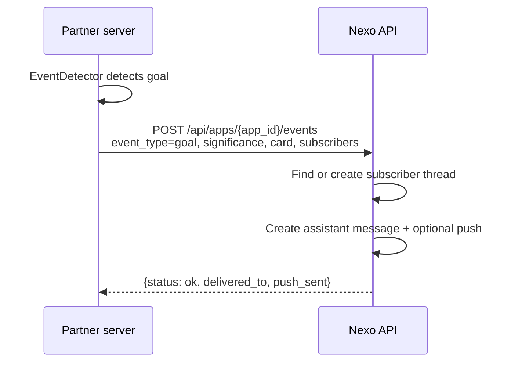
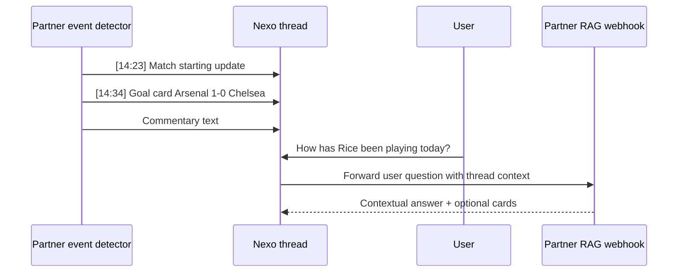

# What You Can Build

Production-ready Partner Integrations built on Nexo. Each example is a complete webhook server you can clone, run locally, and deploy to Cloud Run.

This page is intentionally focused on the external webhook lane. For headless first-party structured apps, use the [Personalized Apps API](micro-apps-api.md).

The RAG examples share a common pattern:

- Ingest domain data (RSS, APIs) into a vector store
- Accept Nexo webhook requests
- Retrieve relevant chunks, call an LLM, return rich responses
- Return `cards` and `actions` alongside the text response

**Runtime configuration:**

- Production (Cloud Run): Gemini on Vertex via ADC
- Development: Gemini on Vertex via ADC (or OpenAI with env override)
- Durable vector storage: `pgvector` on Cloud SQL

---

## Vertical Webhooks

These examples demonstrate end-to-end orchestration flows -- multi-step experiences beyond simple Q&A:

| Example | What it demonstrates | Live URL |
|---|---|---|
| Food Ordering | Restaurant discovery, basket building, checkout approval, and delivery tracking | <https://nexo-food-ordering-v3me5awkta-ew.a.run.app/> |

Source:
- <https://github.com/The-Wordlab/luzia-nexo-api/tree/main/examples/webhook/food-ordering/python>

---

## Push Events API

The RAG examples can push events proactively to subscriber threads using the Nexo Partner API. This turns the chat thread from a static Q&A into a live feed.

### How it works



The result is a thread that behaves like this:



The user can ask questions in the same thread. The message flows through the normal webhook path back to the partner's RAG endpoint, which has all the live data indexed. The LLM sees the full conversation history — including the event cards — and can give contextual answers.

---

## Running examples locally

```bash
git clone git@github.com:The-Wordlab/luzia-nexo-api.git
cd luzia-nexo-api
python3 -m venv .venv
source .venv/bin/activate
pip install -U pip
make test-examples          # unit tests
```

Prerequisites and full deployment guide: [Hosting](hosting.md)

---

## What to build next

These examples demonstrate the Nexo pattern. To build your own integration:

1. **Start from a RAG example** — clone the one closest to your domain, swap in your data sources
2. **Keep the response envelope shape** — `content_parts`, `cards`, `actions` work the same regardless of domain
3. **Add push events** if your domain has time-sensitive data — call `POST /api/apps/{id}/events` whenever something worth notifying happens
4. **Configure in the partner portal** — set your webhook URL and secret, test, submit for review

Full API contract: [Partner API Reference](partner-api-reference.md)
