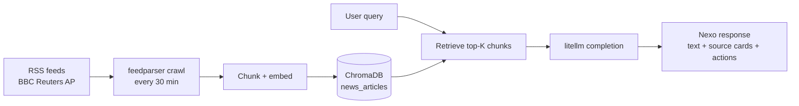
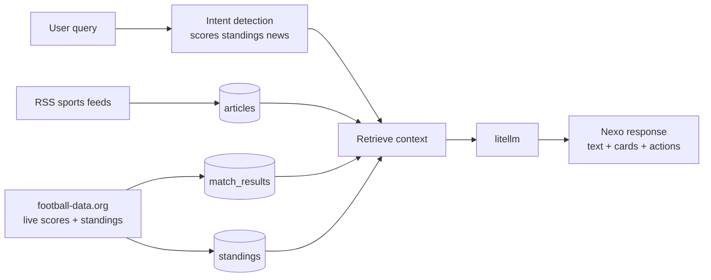
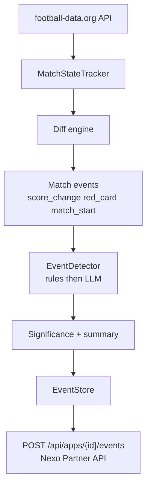
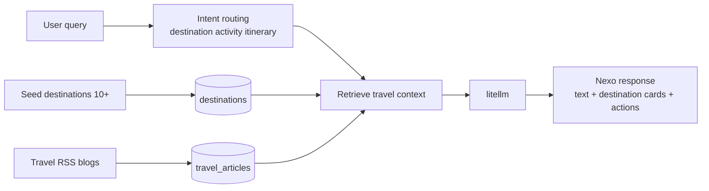
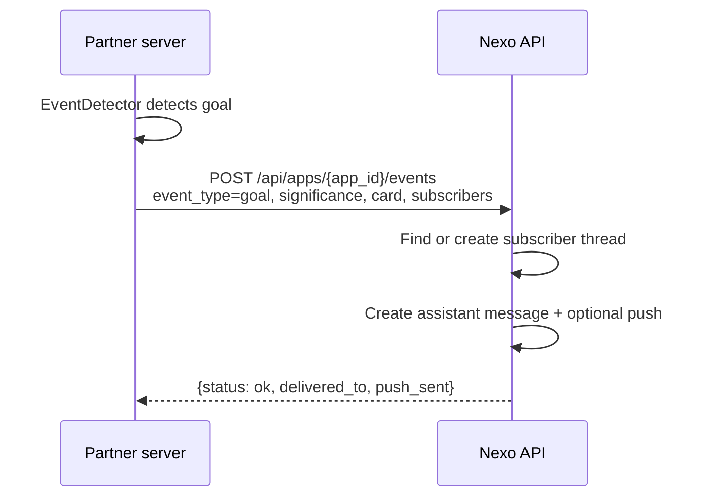
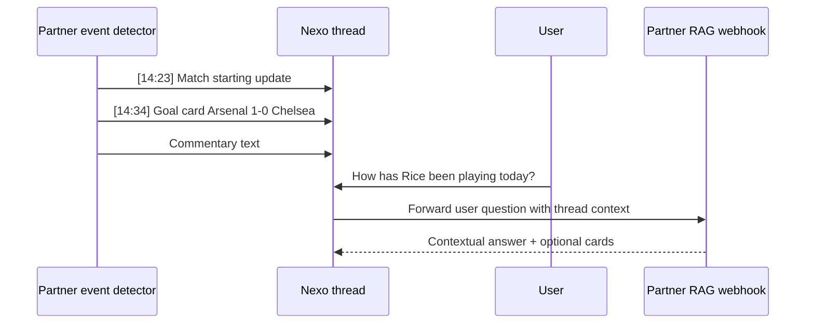

# What You Can Build

Real-world partner integrations built on Nexo. Each example is a full webhook server you can clone, run locally, and deploy to Cloud Run.

All four use the same pattern:
- Ingest domain data (RSS, APIs) into ChromaDB
- Accept Nexo webhook requests
- Retrieve relevant chunks, call an LLM, return rich responses
- Return `cards` and `actions` alongside the text response

---

## News Feed RAG

A news assistant that answers questions about current events using live RSS feeds from BBC, Reuters, and AP. Answers include source attribution cards with links to the original articles.

### Architecture



### What a conversation looks like

User asks: **"What's happening with Arsenal?"**

```json
{
  "schema_version": "2026-03-01",
  "status": "completed",
  "content_parts": [{
    "type": "text",
    "text": "Arsenal are currently 2nd in the Premier League after their 3-1 win over [1]. Manager Mikel Arteta praised the team's pressing intensity, particularly from Saka and Martinelli [2]."
  }],
  "cards": [
    {
      "type": "source",
      "title": "Arsenal extend winning run to five matches",
      "subtitle": "BBC Sport — 2026-03-08",
      "description": "Bukayo Saka scored twice as Arsenal beat Nottingham Forest 3-1...",
      "metadata": { "capability_state": "live", "url": "https://bbc.co.uk/..." }
    },
    {
      "type": "source",
      "title": "Arteta: 'Best performance of the season'",
      "subtitle": "Reuters — 2026-03-08",
      "description": "Arsenal manager Mikel Arteta was effusive after his side's dominant...",
      "metadata": { "capability_state": "live", "url": "https://reuters.com/..." }
    }
  ],
  "actions": [
    { "id": "read_1", "label": "Read full article", "url": "https://bbc.co.uk/...", "style": "secondary" },
    { "id": "read_2", "label": "Read full article", "url": "https://reuters.com/...", "style": "secondary" }
  ]
}
```

### Key code: card builder

```python
def build_source_cards(hits: list[dict]) -> list[dict]:
    unique = deduplicate_sources(hits)[:3]
    return [
        {
            "type": "source",
            "title": hit["title"] or "News Article",
            "subtitle": f"{hit['feed']} — {hit['published'][:16]}",
            "description": hit["excerpt"],
            "metadata": { "capability_state": "live", "url": hit["link"] },
        }
        for hit in unique
    ]
```

### Try it

```bash
curl -X POST "https://nexo-news-rag-v3me5awkta-ew.a.run.app/" \
  -H "Content-Type: application/json" \
  -d '{
    "event": "message_received",
    "message": { "content": "What is the latest news about Arsenal?" },
    "profile": { "display_name": "Jamie" },
    "thread": { "id": "thread-001" },
    "timestamp": "2026-03-09T10:00:00Z"
  }'
```

### Run locally

```bash
cd examples/webhook/news-rag/python
pip install -r requirements.txt
OPENAI_API_KEY=sk-... uvicorn server:app --port 8080
```

The server crawls feeds on startup and re-indexes every 30 minutes.

### Admin endpoints

| Endpoint | Description |
|---|---|
| `POST /ingest` | Trigger on-demand crawl + re-index |
| `GET /health` | Index stats: chunk count, last refresh, model info |

Source: [examples/webhook/news-rag/python](https://github.com/The-Wordlab/luzia-nexo-api/tree/main/examples/webhook/news-rag/python)

---

## Sports Feed RAG

A football assistant with live match data, league standings, and news analysis. Answers questions about scores, transfers, and table positions — with intent detection to route to the right data source.

### Architecture



Three ChromaDB collections, each tuned for different query types:
- `articles` — RSS news, previews, analysis
- `match_results` — Structured match data (teams, scores, scorers, venue)
- `standings` — League table snapshots

### Intent detection

The server detects the user's intent from their message using keyword matching, then routes to the right collection:

```python
_SCORES_RE    = re.compile(r"\b(score|result|win|goal|match|played|full.?time)\b", re.I)
_STANDINGS_RE = re.compile(r"\b(table|standing|position|rank|points|pts)\b", re.I)
_NEWS_RE      = re.compile(r"\b(news|latest|transfer|injury|manager)\b", re.I)
```

### Example interactions

**Scores query:** "What was the Arsenal score yesterday?"

```json
{
  "content_parts": [{ "type": "text", "text": "Arsenal beat Chelsea 2-1 at the Emirates. Rice opened the scoring in the 34th minute before Havertz doubled the lead. Chelsea pulled one back through Palmer, but Arsenal held on." }],
  "cards": [{
    "type": "match_result",
    "title": "Arsenal 2-1 Chelsea",
    "subtitle": "Premier League - Matchday 28",
    "badges": ["Premier League", "Full Time"],
    "fields": [
      { "label": "Date", "value": "2026-03-08" },
      { "label": "Venue", "value": "Emirates Stadium" },
      { "label": "Goals", "value": "Rice 34', Havertz 67'; Palmer 78'" }
    ],
    "metadata": { "capability_state": "live" }
  }],
  "actions": [{ "id": "view_match_1", "label": "View match details: Arsenal vs Chelsea", "url": "...", "style": "secondary" }]
}
```

**Standings query:** "Where are Arsenal in the table?"

```json
{
  "content_parts": [{ "type": "text", "text": "Arsenal are 2nd in the Premier League on 65 points, three behind leaders Liverpool. They have a game in hand..." }],
  "cards": [{
    "type": "standings_table",
    "title": "Premier League Table",
    "subtitle": "Matchday 28 - March 2026",
    "badges": ["Premier League", "2025/26"],
    "fields": [
      { "label": "1. Liverpool", "value": "68 pts" },
      { "label": "2. Arsenal", "value": "65 pts" },
      { "label": "3. Man City", "value": "63 pts" },
      { "label": "4. Chelsea", "value": "58 pts" },
      { "label": "5. Aston Villa", "value": "54 pts" }
    ],
    "metadata": { "capability_state": "live" }
  }]
}
```

### SSE streaming

The server supports SSE streaming when the client sends `Accept: text/event-stream`. Cards and actions are delivered in the final `done` event.

```bash
curl -X POST "https://nexo-sports-rag-v3me5awkta-ew.a.run.app/" \
  -H "Content-Type: application/json" \
  -H "Accept: text/event-stream" \
  -d '{ "message": { "content": "Who scored for Arsenal?" }, "thread": { "id": "t1" }, "timestamp": "2026-03-09T10:00:00Z" }'
```

```
data: {"type":"delta","text":"Rice opened"}
data: {"type":"delta","text":" the scoring in the 34th"}
data: {"type":"delta","text":" minute..."}
data: {"type":"done","schema_version":"2026-03-01","status":"completed","cards":[...],"actions":[...]}
```

### Live event detection

The sports server includes an event detection pipeline that monitors live match state and detects significant moments:



Partners call the Nexo events endpoint to push detected events to subscriber threads. See [Push Events API](#push-events-api) below.

### Try it

```bash
curl -X POST "https://nexo-sports-rag-v3me5awkta-ew.a.run.app/" \
  -H "Content-Type: application/json" \
  -d '{
    "event": "message_received",
    "message": { "content": "What is the Premier League table?" },
    "profile": { "display_name": "Sarah" },
    "thread": { "id": "thread-002" },
    "timestamp": "2026-03-09T10:00:00Z"
  }'
```

### Run locally

```bash
cd examples/webhook/sports-rag/python
pip install -r requirements.txt
OPENAI_API_KEY=sk-... \
FOOTBALL_DATA_API_KEY=<key> \  # optional - free tier at football-data.org
uvicorn server:app --port 8080
```

### Admin endpoints

| Endpoint | Description |
|---|---|
| `POST /ingest` | Full ingest: RSS + live match data + standings |
| `POST /ingest/live` | Lightweight: live matches + standings only (faster) |
| `GET /admin/status` | Collection stats + config |
| `GET /admin/events` | Recent detected events (query by type, team) |
| `POST /admin/detect` | Manually trigger event detection cycle |

Source: [examples/webhook/sports-rag/python](https://github.com/The-Wordlab/luzia-nexo-api/tree/main/examples/webhook/sports-rag/python)

---

## Travel RAG

A travel assistant with destination guides, itinerary advice, and blog content. Answers questions about destinations, things to do, budgets, and best times to visit.

### Architecture



### Example interaction

User asks: **"What should I do in Tokyo for 5 days?"**

```json
{
  "content_parts": [{ "type": "text", "text": "Tokyo in 5 days is very doable. I'd suggest starting in Shinjuku and Shibuya for the classic urban experience, then spending a day in Asakusa and around Senso-ji for old Tokyo..." }],
  "cards": [{
    "type": "destination",
    "title": "Tokyo, Japan",
    "subtitle": "East Asia — Best time: March-May, Sept-Nov",
    "description": "Tokyo is a dizzying blend of ultra-modern and deeply traditional...",
    "badges": ["Culture", "Food", "Technology"],
    "fields": [
      { "label": "Budget", "value": "$100-200/day" },
      { "label": "Language", "value": "Japanese" },
      { "label": "Currency", "value": "Yen (JPY)" }
    ],
    "metadata": { "capability_state": "live" }
  }]
}
```

Seed data covers 10+ destinations including Paris, Tokyo, Barcelona, New York, Bangkok, Cape Town, Sydney, Dubai, Rio de Janeiro, and Reykjavik.

### Try it

```bash
curl -X POST "https://nexo-travel-rag-v3me5awkta-ew.a.run.app/" \
  -H "Content-Type: application/json" \
  -d '{
    "event": "message_received",
    "message": { "content": "What is the best time to visit Japan?" },
    "profile": { "display_name": "Alex" },
    "thread": { "id": "thread-003" },
    "timestamp": "2026-03-09T10:00:00Z"
  }'
```

### Run locally

```bash
cd examples/webhook/travel-rag/python
pip install -r requirements.txt
OPENAI_API_KEY=sk-... uvicorn server:app --port 8080
```

Source: [examples/webhook/travel-rag/python](https://github.com/The-Wordlab/luzia-nexo-api/tree/main/examples/webhook/travel-rag/python)

---

## Football Live RAG

A real-time football assistant focused on scores, standings, and top scorers across multiple leagues.
It supports intent routing (`scores`, `standings`, `scorers`, `general`) and returns rich sports cards
with live-aware metadata.

### Try it

```bash
curl -X POST "https://nexo-football-live-v3me5awkta-ew.a.run.app/" \
  -H "Content-Type: application/json" \
  -d '{
    "event": "message_received",
    "message": { "content": "Who is top scorer in the Premier League?" },
    "thread": { "id": "thread-004" },
    "timestamp": "2026-03-09T10:00:00Z"
  }'
```

### Run locally

```bash
cd examples/webhook/football-live/python
pip install -r requirements.txt
OPENAI_API_KEY=sk-... FOOTBALL_DATA_API_KEY=... uvicorn server:app --port 8003
```

Source: [examples/webhook/football-live/python](https://github.com/The-Wordlab/luzia-nexo-api/tree/main/examples/webhook/football-live/python)

---

## Push Events API

The RAG examples can push events proactively to subscriber threads using the Nexo Partner API. This turns the chat thread from a static Q&A into a live feed.

### How it works



The result is a thread that behaves like this:



The user can ask questions in the same thread. The message flows through the normal webhook path back to the partner's RAG endpoint, which has all the live data indexed. The LLM sees the full conversation history — including the event cards — and can give contextual answers.

For the full architecture and design: [design-live-streaming.md](design-live-streaming.md)

---

## Running all examples locally

All four services can run together using the Makefile:

```bash
git clone git@github.com:The-Wordlab/luzia-nexo-api.git
cd luzia-nexo-api
python3 -m venv .venv
source .venv/bin/activate
pip install -U pip
make test-examples          # unit tests
```

To run individual services:

```bash
# News RAG on :8081
cd examples/webhook/news-rag/python
OPENAI_API_KEY=sk-... uvicorn server:app --port 8081

# Sports RAG on :8082
cd examples/webhook/sports-rag/python
OPENAI_API_KEY=sk-... uvicorn server:app --port 8082

# Travel RAG on :8083
cd examples/webhook/travel-rag/python
OPENAI_API_KEY=sk-... uvicorn server:app --port 8083

# Football Live RAG on :8003
cd examples/webhook/football-live/python
OPENAI_API_KEY=sk-... FOOTBALL_DATA_API_KEY=... uvicorn server:app --port 8003
```

## Deploying to Cloud Run

Deploy all four RAG services with a single command:

```bash
GCP_PROJECT_ID=your-project ./scripts/deploy-rag-examples.sh all
```

Individual targets: `news`, `sports`, `travel`, `football`.

Prerequisites and full deployment guide: [Hosting](hosting.md)

---

## What to build next

These examples demonstrate the Nexo pattern. To build your own integration:

1. **Start from a RAG example** — clone the one closest to your domain, swap in your data sources
2. **Keep the response envelope shape** — `content_parts`, `cards`, `actions` work the same regardless of domain
3. **Add push events** if your domain has time-sensitive data — call `POST /api/apps/{id}/events` whenever something worth notifying happens
4. **Configure in the partner portal** — set your webhook URL and secret, test, submit for review

Full API contract: [API Reference](partner-api-reference.md)
