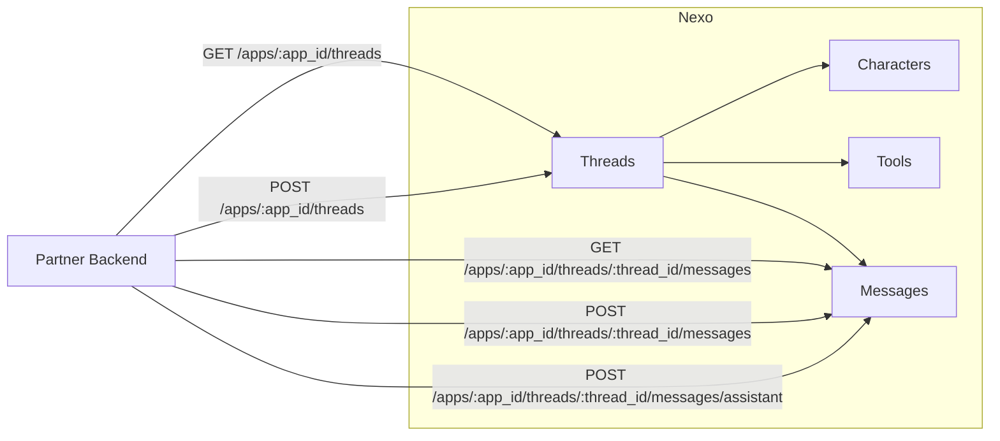

# Luzia Nexo API Docs

Partner-facing documentation for hosted webhook examples, demo receiver infrastructure, and deployment workflows.

## Integration at a glance

## Start here

1. **New partner onboarding**: [Onboarding](onboarding.md)
2. **Full deployment guide**: [Quickstart](quickstart.md)
3. **Visual architecture**: [Integration Diagrams](integration-diagrams.md)

## Live hosted services

- Demo receiver: [nexo-demo-receiver](https://nexo-demo-receiver-v3me5awkta-ew.a.run.app)
- Hosted Python examples: [nexo-examples-py](https://nexo-examples-py-v3me5awkta-ew.a.run.app)
- Hosted TypeScript examples: [nexo-examples-ts](https://nexo-examples-ts-v3me5awkta-ew.a.run.app)

## API secret and support

- Partner portal: [nexo.luzia.com/partners](https://nexo.luzia.com/partners)
- Nexo dashboard: [nexo.luzia.com](https://nexo.luzia.com)
- Support: [mmm@luzia.com](mailto:mmm@luzia.com) (Mark MacMahon)

## What these docs cover

- How to use hosted examples immediately
- How to deploy your own isolated copy on GCP
- Shared secret auth contract for example services
- Demo receiver behavior and guardrails

## Source repository

- [github.com/The-Wordlab/luzia-nexo-api](https://github.com/The-Wordlab/luzia-nexo-api)
