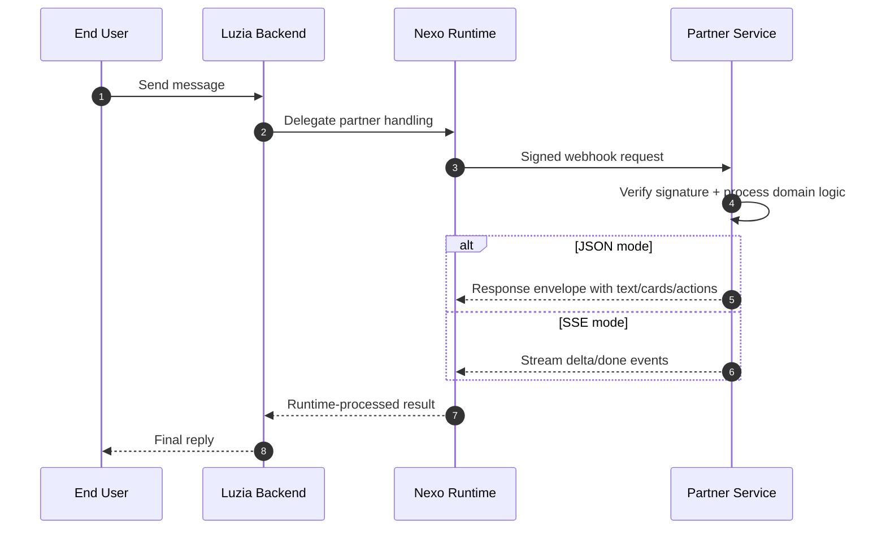

# Luzia Nexo Partner Integration APIs

Build outcome-driven partner assistants on top of a managed Agent Runtime.

Nexo gives you consented profile context, reliable webhook delivery, and runtime orchestration so your team can focus on high-value domain logic and user outcomes.

Launch faster with:

- Signed webhook delivery
- Consented profile context
- Rich cards and actions
- Streaming responses
- Proactive push events
- Out-of-the-box coding examples designed for AI coding agents, so teams can generate, adapt, test, and deploy integrations quickly

From first webhook to production-grade vertical experiences, this platform is designed to help partners go from idea to live integration quickly and safely.

## What You Can Build

Use these deployable examples as starter blueprints:

| Outcome | Example | Live demo |
|---|---|---|
| Morning briefing and follow-up nudges | [Routines](https://github.com/The-Wordlab/luzia-nexo-api/tree/main/examples/webhook/routines/python) | <https://nexo-routines-367427598362.europe-west1.run.app/> |
| Menu-to-checkout ordering flow | [Food Ordering](https://github.com/The-Wordlab/luzia-nexo-api/tree/main/examples/webhook/food-ordering/python) | <https://nexo-food-ordering-367427598362.europe-west1.run.app/> |
| Trip planning with budget and replanning | [Travel Planning](https://github.com/The-Wordlab/luzia-nexo-api/tree/main/examples/webhook/travel-planning/python) | <https://nexo-travel-planning-367427598362.europe-west1.run.app/> |
| News answers with source cards | [News RAG](https://github.com/The-Wordlab/luzia-nexo-api/tree/main/examples/webhook/news-rag/python) | <https://nexo-news-rag-v3me5awkta-ew.a.run.app/> |
| Live sports + event detection | [Sports RAG](https://github.com/The-Wordlab/luzia-nexo-api/tree/main/examples/webhook/sports-rag/python) | <https://nexo-sports-rag-v3me5awkta-ew.a.run.app/> |
| OpenClaw runtime bridge | [OpenClaw Bridge](https://github.com/The-Wordlab/luzia-nexo-api/tree/main/examples/webhook/openclaw-bridge/typescript) | <https://nexo-openclaw-bridge-v3me5awkta-ew.a.run.app/> |

For the full catalog, see [Demo Catalog](demos.md).

## Start Here

1. [Quickstart](quickstart.md) - get a webhook running.
2. [Demo Catalog](demos.md) - browse all demos and live services.
3. [Examples Deep Dive](examples-showcase.md) - inspect full RAG and response patterns.
4. [API Reference](partner-api-reference.md) - integrate contract details.
5. [Hosting](hosting.md) - deploy every server-side demo to Cloud Run.

## Integration Architecture

## Capability Surface

| Capability | What it means in practice | Example |
|---|---|---|
| Webhook contract | Deterministic request and response schema | `webhook/minimal` |
| Rich UI payloads | Cards, actions, structured metadata | `webhook/structured` |
| Operational hardening | Signature checks, retries, idempotency | `webhook/advanced` |
| Retrieval-augmented responses | Domain retrieval + LLM + citations | `news-rag`, `sports-rag`, `travel-rag`, `football-live` |
| Vertical orchestration demos | End-to-end partner flows across routines, food, and travel planning | `routines`, `food-ordering`, `travel-planning` |
| OpenClaw integration | Bridge from Nexo webhook to OpenClaw responses API | `openclaw-bridge` |
| Proactive delivery | Partner-pushed events into subscriber threads | `partner-api/proactive` |

## Live Examples

| Service | URL |
|---|---|
| nexo-news-rag | <https://nexo-news-rag-v3me5awkta-ew.a.run.app/> |
| nexo-sports-rag | <https://nexo-sports-rag-v3me5awkta-ew.a.run.app/> |
| nexo-travel-rag | <https://nexo-travel-rag-v3me5awkta-ew.a.run.app/> |
| nexo-football-live | <https://nexo-football-live-v3me5awkta-ew.a.run.app/> |
| nexo-openclaw-bridge | <https://nexo-openclaw-bridge-v3me5awkta-ew.a.run.app/> |
| nexo-routines | <https://nexo-routines-367427598362.europe-west1.run.app/> |
| nexo-food-ordering | <https://nexo-food-ordering-367427598362.europe-west1.run.app/> |
| nexo-travel-planning | <https://nexo-travel-planning-367427598362.europe-west1.run.app/> |
| nexo-examples-py | <https://nexo-examples-py-v3me5awkta-ew.a.run.app/> |
| nexo-examples-ts | <https://nexo-examples-ts-v3me5awkta-ew.a.run.app/> |
| nexo-demo-receiver | <https://nexo-demo-receiver-v3me5awkta-ew.a.run.app/> |

For source links and what each demo does, use [Demo Catalog](demos.md).

## Design Principles

- Contract-first: same schema rules across local and production.
- Capability-first: docs describe what can be built, not only minimal setup.
- Deployable-by-default: all server demos are deployment-ready.
- Safe configuration: no secrets hardcoded in code or docs.
