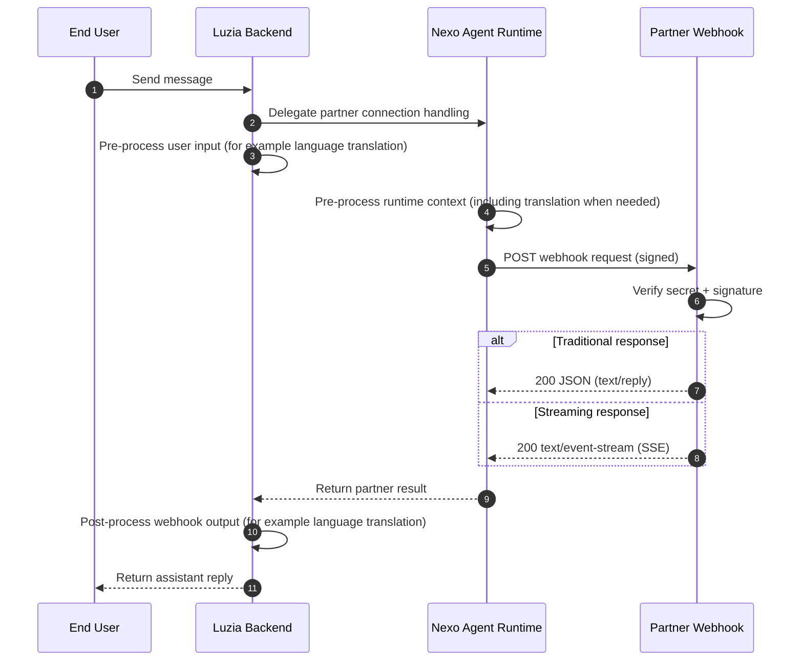

# Luzia Nexo Integration Docs

Start here to integrate quickly with Nexo webhooks and APIs.

Nexo lets you connect your agents to Luzia conversations with minimal integration work. In Luzia, each thread can be linked to a character or to tools, and Nexo handles the partner runtime bridge so your webhook can focus on your agent logic and responses.

## Webhook flow (target architecture)

## Start in 3 steps

1. Get your app secret at [nexo.luzia.com/partners](https://nexo.luzia.com/partners)
2. Implement your webhook using [Quickstart](quickstart.md)
3. Activate your webhook in Nexo by configuring your webhook URL and app secret in the partner portal

Use [API Reference](partner-api-reference.md) for payload, signature, and response contract details.

## Profile context

- Current stable field: `profile.locale`.
- Additional consented profile fields may be present depending on app and rollout configuration.
- Expanded profile field documentation will be added as those fields are promoted to stable contract.

## Optional deployment examples

- Docker and Cloud Run examples: [Hosting (Optional)](hosting.md)

## Support

- [mmm@luzia.com](mailto:mmm@luzia.com)
