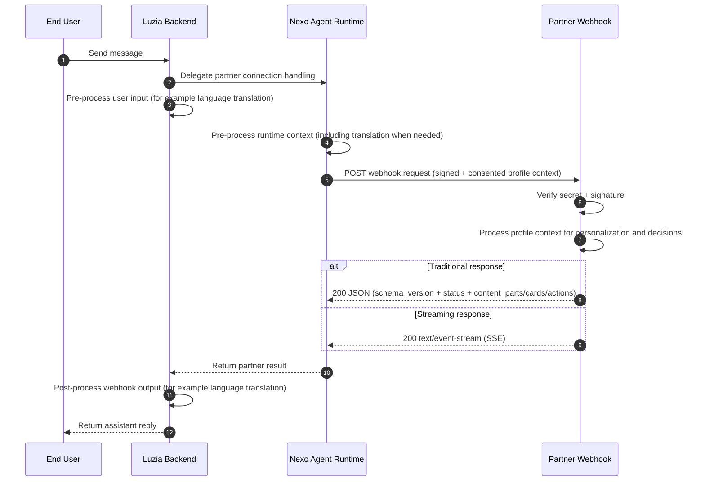

# Luzia Nexo

Luzia Partner Integration APIs.

Nexo provides a managed Agent Runtime with consented user-profile context and reliable webhook delivery, so you can connect your APIs and agentic flows to Luzia with clarity and control.

It's really that simple.

## Webhook flow (integration architecture)

## Start in 3 steps

1. Get your app secret at [nexo.luzia.com/partners](https://nexo.luzia.com/partners)
2. Implement your webhook using [Quickstart](quickstart.md)
3. Activate your webhook in Nexo by configuring your webhook URL and app secret in the partner portal

Use [API Reference](partner-api-reference.md) for payload, signature, and response contract details.

Note: the app secret is required to receive real traffic from Nexo. For local/offline development, you can run and test the example webhook servers directly without creating a partner app first.

## What you can build

Reference implementations showing what a production Nexo partner looks like:

| Example | What it does | Live service | Source |
|---------|-------------|-------------|--------|
| **News Feed RAG** | Answers questions about current events using live RSS feeds. Returns source attribution cards. | [nexo-news-rag](https://nexo-news-rag-v3me5awkta-ew.a.run.app/) | [news-rag/python](https://github.com/The-Wordlab/luzia-nexo-api/tree/main/examples/webhook/news-rag/python) |
| **Sports Feed RAG** | Football scores, standings, transfers. Intent detection routes to the right data. SSE streaming + live event detection. | [nexo-sports-rag](https://nexo-sports-rag-v3me5awkta-ew.a.run.app/) | [sports-rag/python](https://github.com/The-Wordlab/luzia-nexo-api/tree/main/examples/webhook/sports-rag/python) |
| **Travel RAG** | Destination guides with itinerary advice and blog content. Rich destination cards. | [nexo-travel-rag](https://nexo-travel-rag-v3me5awkta-ew.a.run.app/) | [travel-rag/python](https://github.com/The-Wordlab/luzia-nexo-api/tree/main/examples/webhook/travel-rag/python) |
| **Football Live RAG** | Live scores, standings, and top scorers across multiple leagues with real-time updates and rich cards. | [nexo-football-live](https://nexo-football-live-v3me5awkta-ew.a.run.app/) | [football-live/python](https://github.com/The-Wordlab/luzia-nexo-api/tree/main/examples/webhook/football-live/python) |

Full walkthrough with architecture diagrams and example responses: [Examples Showcase](examples-showcase.md)

## Live examples (minimal reference)

Minimal hosted reference services (echo + profile context):

| Language | Live service | Source code |
|----------|-------------|-------------|
| Python | [nexo-examples-py](https://nexo-examples-py-v3me5awkta-ew.a.run.app/) | [examples/hosted/python](https://github.com/The-Wordlab/luzia-nexo-api/tree/main/examples/hosted/python) |
| TypeScript | [nexo-examples-ts](https://nexo-examples-ts-v3me5awkta-ew.a.run.app/) | [examples/hosted/typescript](https://github.com/The-Wordlab/luzia-nexo-api/tree/main/examples/hosted/typescript) |

Core webhook examples are also deployable as dedicated Cloud Run services:
- minimal (Python + TypeScript)
- structured (Python)
- advanced (Python)
- OpenClaw bridge (TypeScript)
- all RAG services (news, sports, travel, football-live)

See [Hosting (Optional)](hosting.md) for the full deployment matrix and commands.

For standalone webhook snippets see [examples/webhook](https://github.com/The-Wordlab/luzia-nexo-api/tree/main/examples/webhook).

If you are connecting through OpenClaw, use the OpenClaw Bridge example:
- [examples/webhook/openclaw-bridge](https://github.com/The-Wordlab/luzia-nexo-api/tree/main/examples/webhook/openclaw-bridge)

## Profile context

- Webhook payloads include consented profile attributes such as:
  - `locale`
  - `language`
  - `location` (for example city/country)
  - `age` or age range
  - `date_of_birth`
  - `gender`
  - `dietary_preferences`
  - `preferences` and selected profile facts
- Availability depends on app permissions and user consent.
- Additional attributes are added over time while keeping backward compatibility.
- Parse defensively and ignore unknown fields.

## Push events (partner-initiated)

Partners can push events proactively into subscriber threads using `POST /api/apps/{app_id}/events`. This turns the chat thread into a live feed — goals appear as they happen, breaking news streams in without the user asking.

The sports-rag example includes a working event detection pipeline: it polls football-data.org, diffs match state, classifies significance with an LLM, and pushes to Nexo whenever something worth notifying happens.

See [API Reference - Push Events API](partner-api-reference.md#push-events-api-partner-initiated) for the full contract.

## App lifecycle

Apps go through a review workflow: **draft** -> **submitted** -> **approved** (or **rejected**).
Once approved, your app appears in the public catalog (`GET /api/catalog/apps`).
See [API Reference - App lifecycle](partner-api-reference.md#app-lifecycle) for details.

## TypeScript SDK

The `@nexo/partner-sdk` package provides webhook signature verification and a proactive messaging client.
See [API Reference - TypeScript SDK](partner-api-reference.md#typescript-sdk) for details.

## Optional deployment examples

- Docker and Cloud Run examples: [Hosting (Optional)](hosting.md)

## Support

- [mmm@luzia.com](mailto:mmm@luzia.com)
