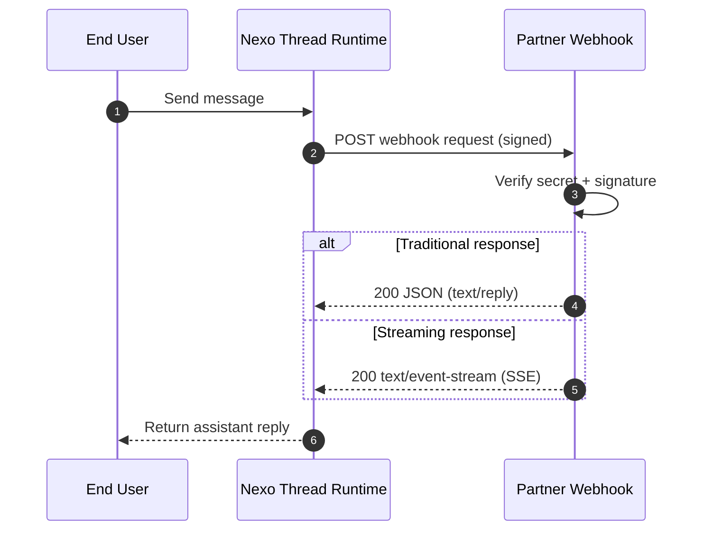

# Nexo Partner Integration Docs

Start here if you want to integrate quickly with Nexo webhooks and Partner APIs.

## Webhook flow

## Start in 3 steps

1. Get your app secret at [nexo.luzia.com/partners](https://nexo.luzia.com/partners)
2. Follow [Quickstart](quickstart.md)
3. Copy a runnable integration from [Examples](examples.md)

## Hosted examples

- Python: [nexo-examples-py](https://nexo-examples-py-v3me5awkta-ew.a.run.app)
- TypeScript: [nexo-examples-ts](https://nexo-examples-ts-v3me5awkta-ew.a.run.app)

## Support

- [mmm@luzia.com](mailto:mmm@luzia.com)
