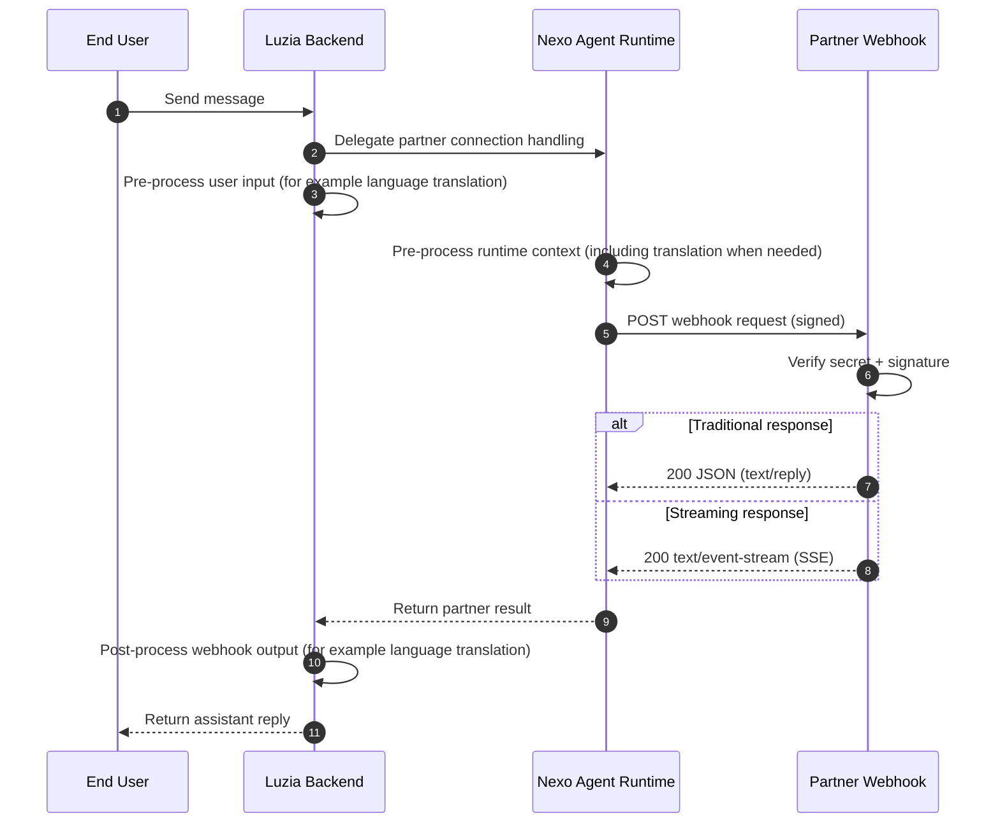

# Nexo Integration Docs

Start here to integrate quickly with Nexo webhooks and APIs.

Nexo lets you connect your agents to Luzia conversations with minimal integration work. In Luzia, each thread can be linked to a character or to tools, and Nexo handles the partner runtime bridge so your webhook can focus on your agent logic and responses.

## Webhook flow (target architecture)

## Start in 4 steps

1. Get your app secret at [nexo.luzia.com/partners](https://nexo.luzia.com/partners)
2. Implement your webhook using [Quickstart](quickstart.md)
3. Enable your integration in Nexo by configuring your webhook URL and secret in the partner portal
4. Validate payload and response contracts with [API Reference](partner-api-reference.md)

## Optional deployment examples

- Docker and Cloud Run examples: [Hosting (Optional)](hosting.md)

## Support

- [mmm@luzia.com](mailto:mmm@luzia.com)
