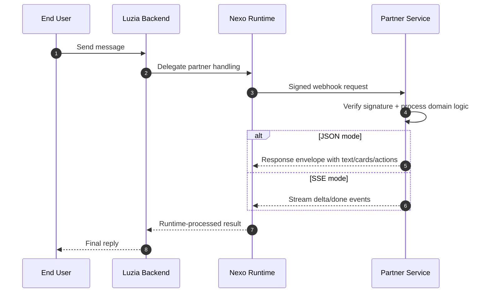

# Luzia Nexo API

Connect your agent or API to Luzia characters through the Nexo Agent Runtime API.

The Nexo Agent Runtime provides reliable webhook delivery, consented profile context, and trusted boundaries your customers can understand.

Launch fast with:

- Signed webhook delivery
- Consented profile context
- Rich cards and actions
- Streaming responses
- Proactive push events
- Starter coding examples that AI coding agents can adapt, test, and deploy

This repository provides deployment-ready integration templates.

!!! tip "Nexo dashboard"
    Manage apps, webhook secrets, and live tests in the partner dashboard.

    [Open Nexo Dashboard](https://nexo.luzia.com){ .md-button .md-button--primary }

## 5-minute path

If you only need the shortest path to a real integration:

1. Implement one `POST /webhook` endpoint in your backend.
2. Return valid JSON (or SSE) response envelope.
3. In Nexo, set your `webhook_url` and `WEBHOOK_SECRET`.
4. Send a test message from the dashboard.

Start here: [Quickstart](quickstart.md)

### Optional UX accelerator: contextual prompt chips

To improve first-message UX, your webhook can optionally return
`metadata.prompt_suggestions`. Nexo renders these as clickable chips in chat.

```json
{
  "schema_version": "2026-03-01",
  "status": "completed",
  "content_parts": [{ "type": "text", "text": "I can help with that." }],
  "metadata": {
    "prompt_suggestions": [
      "Show me options",
      "Track status",
      "What do you recommend?"
    ]
  }
}
```

### Required vs optional

- Required for live webhook integration: `webhook_url` + `WEBHOOK_SECRET`
- Optional for advanced flows: cards/actions, proactive events, RAG, OpenClaw bridge

## What You Can Build

Use these deployable examples as starter blueprints:

| Outcome | Example | Live demo |
|---|---|---|
| Morning briefing and follow-up nudges | [Routines](https://github.com/The-Wordlab/luzia-nexo-api/tree/main/examples/webhook/routines/python) | <https://nexo-routines-367427598362.europe-west1.run.app/> |
| Food-commerce flow with discovery, checkout, and tracking | [Food Ordering](https://github.com/The-Wordlab/luzia-nexo-api/tree/main/examples/webhook/food-ordering/python) | <https://nexo-food-ordering-367427598362.europe-west1.run.app/> |
| Travel flagship with flights, budget, handoff, and replanning | [Travel Planning](https://github.com/The-Wordlab/luzia-nexo-api/tree/main/examples/webhook/travel-planning/python) | <https://nexo-travel-planning-367427598362.europe-west1.run.app/> |
| Fitness coaching plans and check-ins | [Fitness Coach](https://github.com/The-Wordlab/luzia-nexo-api/tree/main/examples/webhook/fitness-coach/python) | <https://nexo-fitness-coach-367427598362.europe-west1.run.app/> |
| Compatibility travel slice for booking handoff | [Travel Planner](https://github.com/The-Wordlab/luzia-nexo-api/tree/main/examples/webhook/travel-planner/python) | <https://nexo-travel-planner-367427598362.europe-west1.run.app/> |
| Language tutoring with lesson and quiz cards | [Language Tutor](https://github.com/The-Wordlab/luzia-nexo-api/tree/main/examples/webhook/language-tutor/python) | <https://nexo-language-tutor-367427598362.europe-west1.run.app/> |
| News answers with source cards | [News RAG](https://github.com/The-Wordlab/luzia-nexo-api/tree/main/examples/webhook/news-rag/python) | <https://nexo-news-rag-v3me5awkta-ew.a.run.app/> |
| Broad sports coverage with football deep-dive companion | [Sports RAG](https://github.com/The-Wordlab/luzia-nexo-api/tree/main/examples/webhook/sports-rag/python) | <https://nexo-sports-rag-v3me5awkta-ew.a.run.app/> |
| OpenClaw runtime bridge | [OpenClaw Bridge](https://github.com/The-Wordlab/luzia-nexo-api/tree/main/examples/webhook/openclaw-bridge/typescript) | <https://nexo-openclaw-bridge-v3me5awkta-ew.a.run.app/> |

For the full catalog, see [Demo Catalog](demos.md).

## Start Here

1. [Quickstart](quickstart.md) - get a webhook live in minutes.
2. [Demo Catalog](demos.md) - browse all demos and live services.
3. [Examples Deep Dive](examples-showcase.md) - inspect full RAG and response patterns.
4. [API Reference](partner-api-reference.md) - integrate contract details.
5. [Hosting](hosting.md) - deploy every server-side demo to Cloud Run.

## Integration Architecture



## Capability Surface

| Capability | What it means in practice | Example |
|---|---|---|
| Webhook contract | Deterministic request and response schema | `webhook/minimal` |
| Rich UI payloads | Cards, actions, structured metadata | `webhook/structured` |
| Operational hardening | Signature checks, retries, idempotency | `webhook/advanced` |
| Retrieval-augmented responses | Domain retrieval + LLM + citations | `news-rag`, `sports-rag`, `travel-rag`, `football-live` |
| Vertical orchestration demos | End-to-end partner flows across routines, food, and travel planning | `routines`, `food-ordering`, `travel-planning` |
| OpenClaw integration | Bridge from Nexo webhook to OpenClaw responses API | `openclaw-bridge` |
| Proactive delivery | Partner-pushed events into subscriber threads | `partner-api/proactive` |

## Live Examples

| Service | URL |
|---|---|
| nexo-news-rag | <https://nexo-news-rag-v3me5awkta-ew.a.run.app/> |
| nexo-sports-rag | <https://nexo-sports-rag-v3me5awkta-ew.a.run.app/> |
| nexo-travel-rag | <https://nexo-travel-rag-v3me5awkta-ew.a.run.app/> |
| nexo-football-live | <https://nexo-football-live-v3me5awkta-ew.a.run.app/> |
| nexo-openclaw-bridge | <https://nexo-openclaw-bridge-v3me5awkta-ew.a.run.app/> |
| nexo-routines | <https://nexo-routines-367427598362.europe-west1.run.app/> |
| nexo-food-ordering | <https://nexo-food-ordering-367427598362.europe-west1.run.app/> |
| nexo-travel-planning | <https://nexo-travel-planning-367427598362.europe-west1.run.app/> |
| nexo-fitness-coach | <https://nexo-fitness-coach-367427598362.europe-west1.run.app/> |
| nexo-travel-planner | <https://nexo-travel-planner-367427598362.europe-west1.run.app/> |
| nexo-language-tutor | <https://nexo-language-tutor-367427598362.europe-west1.run.app/> |
| nexo-examples-py | <https://nexo-examples-py-v3me5awkta-ew.a.run.app/> |
| nexo-examples-ts | <https://nexo-examples-ts-v3me5awkta-ew.a.run.app/> |
| nexo-demo-receiver | <https://nexo-demo-receiver-v3me5awkta-ew.a.run.app/> |

For source links and what each demo does, use [Demo Catalog](demos.md).

## Design Principles

- Contract-first: same schema rules across local and production.
- Capability-first: docs describe what can be built, not only minimal setup.
- Deployable-by-default: all server demos are deployment-ready.
- Privacy is structural: consent and profile boundaries are part of the runtime contract.
- Safe configuration: no secrets hardcoded in code or docs.
