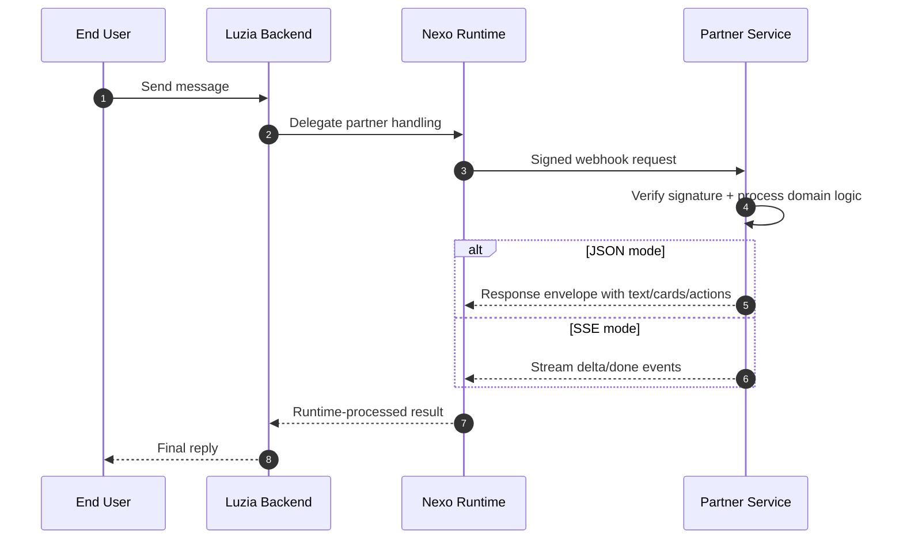

# Luzia Nexo API

Build apps for Luzia users.

The Nexo Agent Runtime handles message routing, delivery, signature verification, and consent management -- so you can focus on your domain logic.

Ship your first integration in minutes:

- **Signed webhook delivery** -- every request is HMAC-verified
- **Approved profile context** -- locale, preferences, and more, released by Nexo after consent
- **Rich cards and actions** -- structured UI beyond plain text
- **Streaming responses** -- real-time SSE for responsive experiences
- **Proactive push events** -- notify users when something happens in your domain
- **Production-ready examples** -- clone, customize, deploy

!!! tip "Nexo dashboard"
    Manage apps, webhook secrets, and live tests in the partner dashboard.

    [Open Nexo Dashboard](https://nexo.luzia.com){ .md-button .md-button--primary }

## 5-minute path

**Partner Integration lane (primary external path):**

1. Implement one `POST /webhook` endpoint in your backend.
2. Return a valid JSON (or SSE) response envelope.
3. In Nexo, set your `webhook_url` and `WEBHOOK_SECRET`.
4. Send a test message from the dashboard.

**Personalized Apps lane (developer-driven):**

1. Get a developer key from the dashboard (Profile → Developer Access)
2. `export NEXO_DEVELOPER_KEY=nexo_uak_...`
3. `export NEXO_BASE_URL=http://localhost:8000`
4. `claude mcp add --scope project --transport http nexo-mcp "${NEXO_BASE_URL}/mcp" -H "X-Api-Key: ${NEXO_DEVELOPER_KEY}"`
5. Ask: "Create an expense tracker for shared household bills"

Or use the REST API directly: [Personalized Apps API](micro-apps-api.md)

Start here: [Quickstart](quickstart.md) | [Personalized Apps API](micro-apps-api.md) | [MCP Server](mcp.md)

### Prompt chips

Improve first-message UX by returning `metadata.prompt_suggestions` in your webhook response. Nexo renders these as clickable chips in chat.

```json
{
  "schema_version": "2026-03",
  "task": { "id": "tsk_1", "status": "completed" },
  "content_parts": [{ "type": "text", "text": "I can help with that." }],
  "metadata": {
    "prompt_suggestions": [
      "Show me options",
      "Track status",
      "What do you recommend?"
    ]
  }
}
```

### Required vs optional

- **Required** for live Partner Integrations: `webhook_url` + `WEBHOOK_SECRET`
- **Optional** for advanced flows: cards/actions, proactive events, RAG, OpenClaw bridge

## What You Can Build

Clone a starter example, customize it for your domain, and deploy:

| Use case | Example | Live demo |
|---|---|---|
| Morning briefing and follow-up nudges | [Routines](https://github.com/The-Wordlab/luzia-nexo-api/tree/main/examples/webhook/routines/python) | <https://nexo-routines-v3me5awkta-ew.a.run.app/> |
| Food-commerce: discovery, checkout, tracking | [Food Ordering](https://github.com/The-Wordlab/luzia-nexo-api/tree/main/examples/webhook/food-ordering/python) | <https://nexo-food-ordering-v3me5awkta-ew.a.run.app/> |
| Travel: flights, budget, handoff, replanning | [Travel Planning](https://github.com/The-Wordlab/luzia-nexo-api/tree/main/examples/webhook/travel-planning/python) | <https://nexo-travel-planning-v3me5awkta-ew.a.run.app/> |
| News answers with source cards | [News RAG](https://github.com/The-Wordlab/luzia-nexo-api/tree/main/examples/webhook/news-rag/python) | <https://nexo-news-rag-v3me5awkta-ew.a.run.app/> |
| Sports coverage with live match data | [Sports RAG](https://github.com/The-Wordlab/luzia-nexo-api/tree/main/examples/webhook/sports-rag/python) | <https://nexo-sports-rag-v3me5awkta-ew.a.run.app/> |
| OpenClaw runtime bridge | [OpenClaw Bridge](https://github.com/The-Wordlab/luzia-nexo-api/tree/main/examples/webhook/openclaw-bridge/typescript) | <https://nexo-openclaw-bridge-v3me5awkta-ew.a.run.app/> |

For the full catalog, see [Demo Catalog](demos.md).

## Start Here

1. [Quickstart](quickstart.md) -- get a Partner Integration live in minutes.
2. [Demo Catalog](demos.md) -- browse all examples and live services.
3. [Examples Deep Dive](examples-showcase.md) -- architecture and response patterns.
4. [Partner API Reference](partner-api-reference.md) -- full webhook/runtime contract details.
5. [Personalized Apps API](micro-apps-api.md) -- create and manage personalized apps from CLI or MCP.
6. [MCP Server](mcp.md) -- connect AI coding assistants to Nexo tools.
7. [Internal Apps](internal-apps.md) -- boundary note pointing back to the Nexo-owned implementation docs.
8. [Hosting](hosting.md) -- deploy to Cloud Run.

## Integration Architecture



## Consent Boundary

Nexo fully owns consent collection, storage, and scope enforcement.

- The user grants or denies profile access in the Nexo experience.
- Nexo decides which profile fields may be released for a given app and turn.
- Your webhook receives only the approved scoped profile data.
- Your webhook does not implement consent logic and does not need to know how the user granted it.

## Capabilities

| Capability | Description | Example |
|---|---|---|
| Webhook contract | Deterministic request and response schema for Partner Integrations | `webhook/minimal` |
| Rich UI payloads | Cards, actions, structured metadata | `webhook/structured` |
| Signature verification | HMAC-SHA256 request signing and verification | `webhook/advanced` |
| Retrieval-augmented responses | Domain retrieval + LLM + citations | `news-rag`, `sports-rag`, `travel-rag`, `football-live` |
| Vertical orchestration | End-to-end partner flows: routines, food ordering, travel planning | `routines`, `food-ordering`, `travel-planning` |
| OpenClaw integration | Bridge from Nexo webhook to OpenClaw responses API | `openclaw-bridge` |
| Proactive delivery | Push events into subscriber threads | `partner-api/proactive` |
| Personalized Apps API | Create and manage structured apps via REST | [micro-apps-api](micro-apps-api.md) |
| MCP server | Expose Partner Integration and Personalized Apps tools to AI coding assistants | [mcp](mcp.md) |

## Live Examples

| Service | URL |
|---|---|
| nexo-news-rag | <https://nexo-news-rag-v3me5awkta-ew.a.run.app/> |
| nexo-sports-rag | <https://nexo-sports-rag-v3me5awkta-ew.a.run.app/> |
| nexo-travel-rag | <https://nexo-travel-rag-v3me5awkta-ew.a.run.app/> |
| nexo-football-live | <https://nexo-football-live-v3me5awkta-ew.a.run.app/> |
| nexo-openclaw-bridge | <https://nexo-openclaw-bridge-v3me5awkta-ew.a.run.app/> |
| nexo-routines | <https://nexo-routines-v3me5awkta-ew.a.run.app/> |
| nexo-food-ordering | <https://nexo-food-ordering-v3me5awkta-ew.a.run.app/> |
| nexo-travel-planning | <https://nexo-travel-planning-v3me5awkta-ew.a.run.app/> |
| nexo-examples-py | <https://nexo-examples-py-v3me5awkta-ew.a.run.app/> |
| nexo-examples-ts | <https://nexo-examples-ts-v3me5awkta-ew.a.run.app/> |
| nexo-demo-receiver | <https://nexo-demo-receiver-v3me5awkta-ew.a.run.app/> |

For source links and what each demo does, see [Demo Catalog](demos.md).

## Design Principles

- **Contract-first:** Same schema rules across local and production.
- **Capability-first:** Docs describe what you can build, not just minimal setup.
- **Deployable by default:** All server examples are production-ready.
- **Privacy is structural:** Consent and profile boundaries are part of the runtime contract.
- **Safe configuration:** No secrets hardcoded in code or docs.

## Product language

- In customer-facing product surfaces, Nexo uses **Personalized Apps**.
- Internally and in code, you may still see the technical term **micro apps**.
- **Partner Integrations** remain the external webhook-backed app family.
