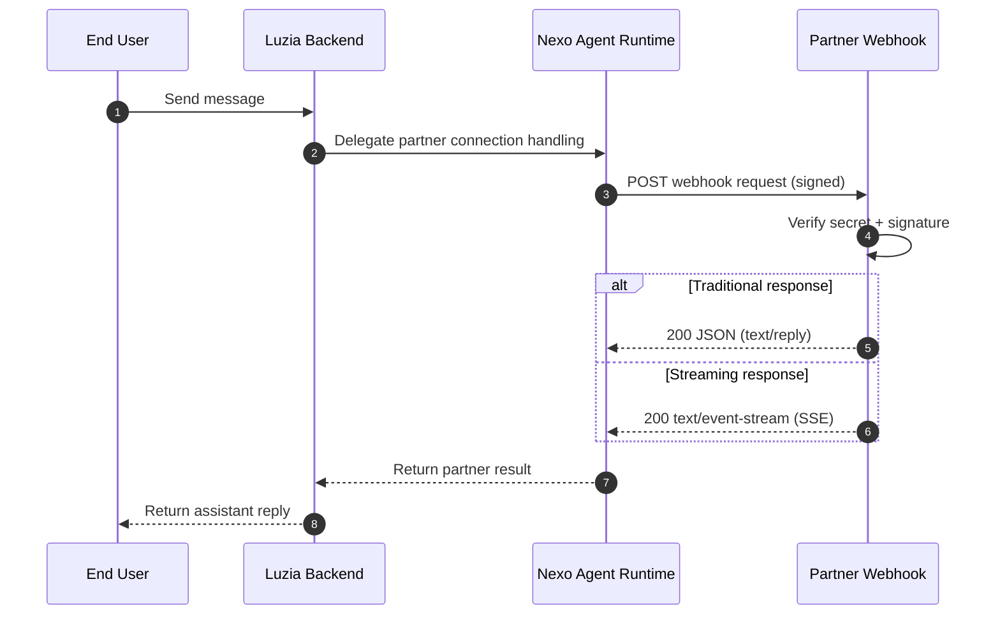

# Nexo Integration Docs

Start here to integrate quickly with Nexo webhooks and APIs.

## Webhook flow (target architecture)

## Start in 3 steps

1. Get your app secret at [nexo.luzia.com/partners](https://nexo.luzia.com/partners)
2. Implement your webhook using [Quickstart](quickstart.md)
3. Use [API Reference](partner-api-reference.md) for webhook contract and examples

## Optional deployment examples

- Docker and Cloud Run examples: [Hosting (Optional)](hosting.md)

## Support

- [mmm@luzia.com](mailto:mmm@luzia.com)
