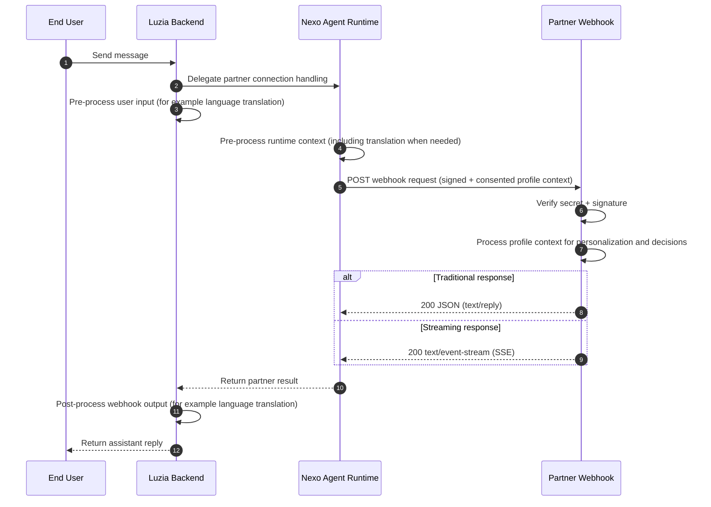

# Lucia Nexo

Luzia Partner Integration APIs.

Integrate your backend with Luzia through Nexo using webhooks and APIs. Nexo provides a clean thread-based interface, consented user profile context, and managed webhook delivery so you can focus on agent logic and response quality.

It's really that simple.

## Webhook flow (integration architecture)

## Start in 3 steps

1. Get your app secret at [nexo.luzia.com/partners](https://nexo.luzia.com/partners)
2. Implement your webhook using [Quickstart](quickstart.md)
3. Activate your webhook in Nexo by configuring your webhook URL and app secret in the partner portal

Use [API Reference](partner-api-reference.md) for payload, signature, and response contract details.

## Live examples

You can test simple hosted examples before building your own implementation:

- Python examples service: [nexo-examples-py](https://nexo-examples-py-v3me5awkta-ew.a.run.app/)
  - [info](https://nexo-examples-py-v3me5awkta-ew.a.run.app/info)
  - [minimal webhook endpoint](https://nexo-examples-py-v3me5awkta-ew.a.run.app/webhook/minimal)
- TypeScript examples service: [nexo-examples-ts](https://nexo-examples-ts-v3me5awkta-ew.a.run.app/)
  - [info](https://nexo-examples-ts-v3me5awkta-ew.a.run.app/info)
  - [minimal webhook endpoint](https://nexo-examples-ts-v3me5awkta-ew.a.run.app/webhook/minimal)

Use these as reference implementations, then adapt code from [github.com/The-Wordlab/luzia-nexo-api/tree/main/examples](https://github.com/The-Wordlab/luzia-nexo-api/tree/main/examples) for your own environment.

## Profile context

- Webhook payloads include consented profile attributes such as:
  - `locale`
  - `language`
  - `location` (for example city/country)
  - `age` or age range
  - `date_of_birth`
  - `gender`
  - `dietary_preferences`
  - `preferences` and selected profile facts
- Availability depends on app permissions and user consent.
- Additional attributes are added over time while keeping backward compatibility.
- Parse defensively and ignore unknown fields.

## Optional deployment examples

- Docker and Cloud Run examples: [Hosting (Optional)](hosting.md)

## Support

- [mmm@luzia.com](mailto:mmm@luzia.com)
