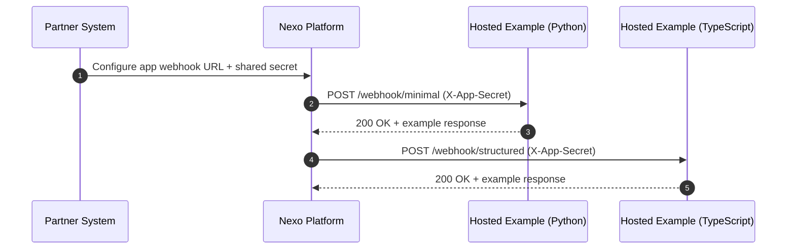
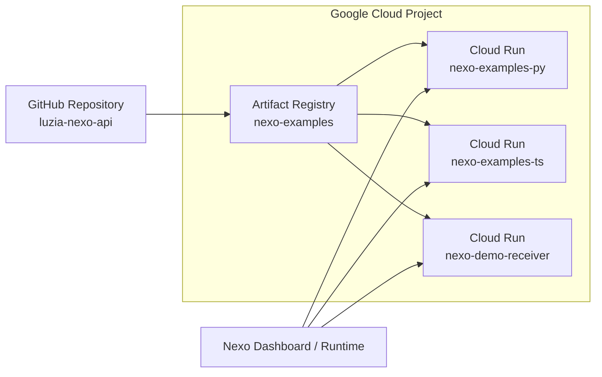
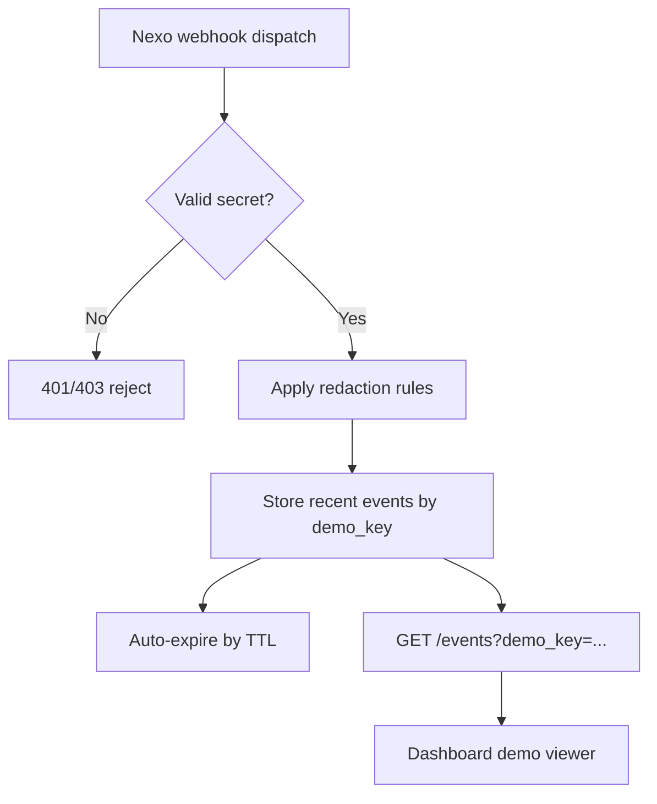
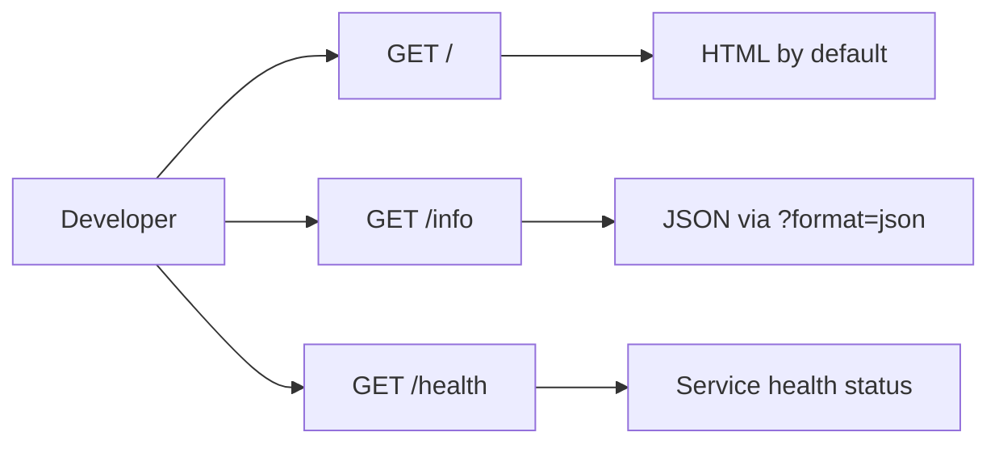

# Integration Diagrams

These diagrams show how partners integrate with hosted examples and the demo receiver.

## 1) End-to-end webhook flow

## 2) Hosted services topology

## 3) Demo receiver capture flow

## 4) Health and discovery endpoints

