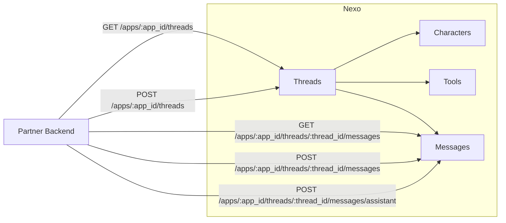

# Integration Diagrams

Simple partner-facing architecture for how Nexo conversations map to partner APIs.

## Conversation and partner API model

```mermaid
flowchart LR
    Partner[Partner Backend]

    subgraph Nexo[Nexo]
      Threads[Threads]
      Characters[Characters]
      Tools[Tools]
      Messages[Messages]
    end

    Threads --> Characters
    Threads --> Tools
    Threads --> Messages

    Partner -->|GET /apps/:app_id/threads| Threads
    Partner -->|GET /apps/:app_id/threads/:thread_id/messages| Messages
    Partner -->|POST /apps/:app_id/threads| Threads
    Partner -->|POST /apps/:app_id/threads/:thread_id/messages| Messages
    Partner -->|POST /apps/:app_id/threads/:thread_id/messages/assistant| Messages
```
