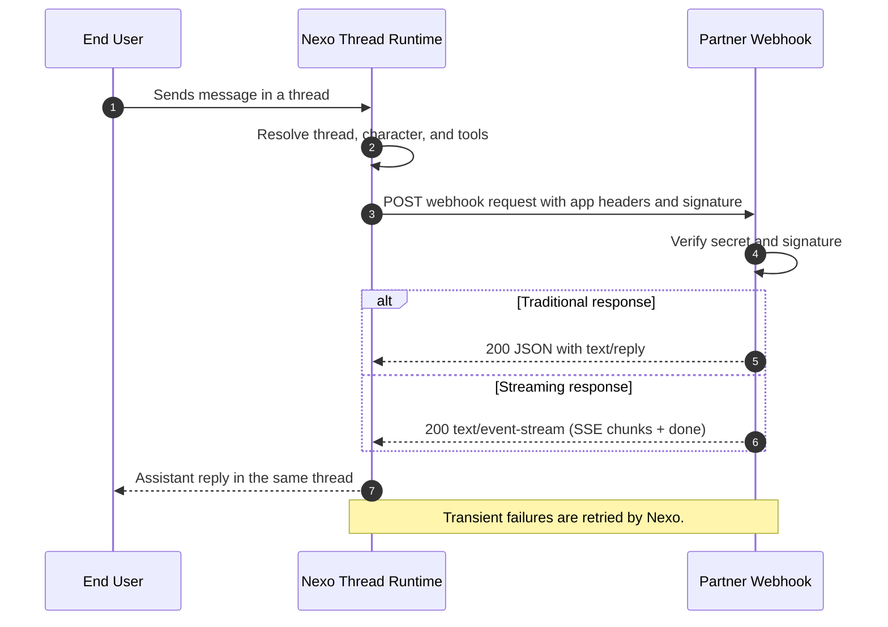
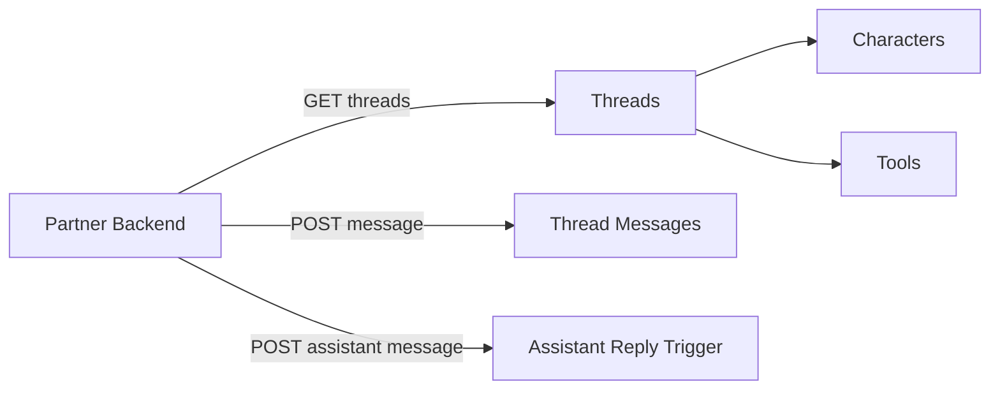

# Integration Diagrams

## 1) Webhook flow (primary integration path)

```mermaid
sequenceDiagram
    autonumber
    participant User as End User
    participant Nexo as Nexo Thread Runtime
    participant Partner as Partner Webhook

    User->>Nexo: Sends message in a thread
    Nexo->>Nexo: Resolve thread, character, and tools
    Nexo->>Partner: POST webhook request with app headers and signature
    Partner->>Partner: Verify secret and signature
    alt Traditional response
        Partner-->>Nexo: 200 JSON with text/reply
    else Streaming response
        Partner-->>Nexo: 200 text/event-stream (SSE chunks + done)
    end
    Nexo-->>User: Assistant reply in the same thread
    Note over Nexo,Partner: Transient failures are retried by Nexo.
```

## 2) Partner API flow (optional proactive path)

```mermaid
flowchart LR
    Partner[Partner Backend] -->|GET threads| Threads[Threads]
    Partner -->|POST message| Messages[Thread Messages]
    Partner -->|POST assistant message| Assistant[Assistant Reply Trigger]
    Threads --> Characters[Characters]
    Threads --> Tools[Tools]
```
